# Architecture

## 1. Purpose

This document describes the target architecture for **AI Dev Workstation as Code**.

I am building this as a local-first, gateway-led AI workstation that can support development, architecture, writing, research and future agent workflows across multiple devices.

The architecture is intended to be:

- rebuildable
- modular
- profile-aware
- secure by default
- CLI-native
- local-first
- frontier-capable
- replaceable over time

This is not intended to be a production enterprise AI platform. It is a personal AI workstation architecture that borrows useful platform patterns: gateway, routing, profiles, policy, validation, component lifecycle and infrastructure-as-code style rebuildability.

---

## 2. Architecture goals

The architecture should allow me to:

- use local models by default
- route complex tasks to frontier models when justified
- keep work and personal usage separated
- use approved work AI tools first on the work profile
- use OpenAI and Anthropic more freely on the personal profile
- work primarily from the CLI
- support UI and IDE workflows without creating separate AI environments
- add and replace tools as the ecosystem changes
- rebuild the workstation from code and configuration
- validate whether the environment is healthy
- introduce agents later without redesigning the system

---

## 3. Architectural approach

The chosen approach is:

```text
Gateway-first, profile-aware, workstation-as-code.
```

This means:

- user-facing workflows should be stable
- model providers and local runtimes should be replaceable
- routing should happen through a common control point where practical
- profiles should drive behaviour by device and use case
- bootstrap and validation should make the workstation rebuildable
- custom code should be thin and focused on glue, validation and workflow consistency

---

## 4. High-level architecture

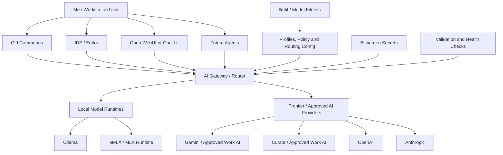

The key architectural point is that the CLI, UI, IDE and future agents should not each become separate AI environments. Where practical, they should use the same gateway, profile and routing model.

---

## 5. System context

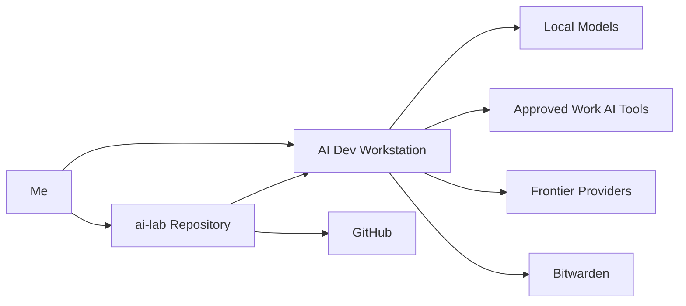

The repository is the source of truth for the workstation. Local machine state should be treated as rebuildable or disposable.

---

## 6. Architecture layers

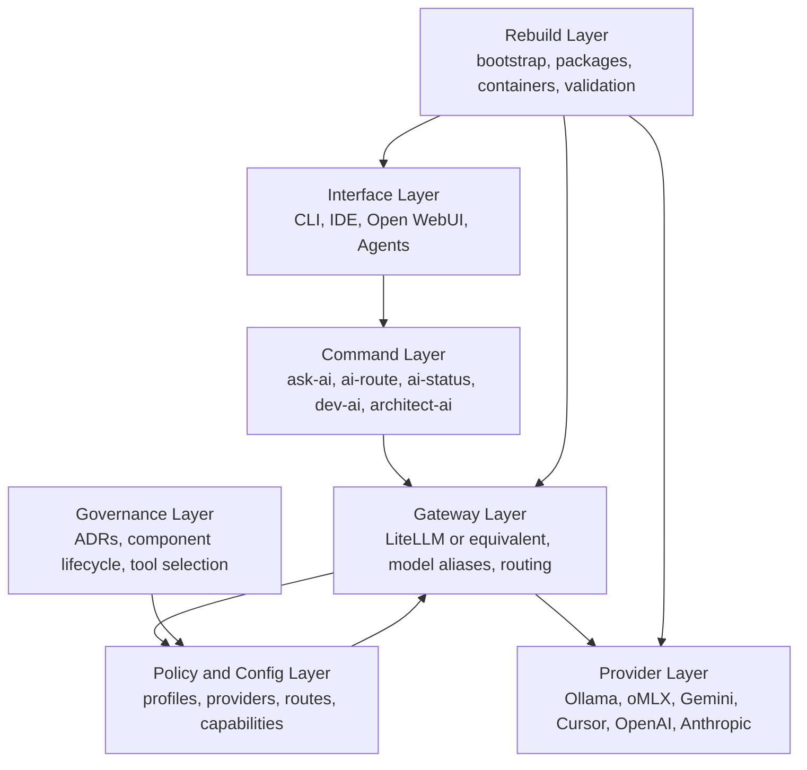

---

## 7. Layer responsibilities

| Layer | Responsibility |
|---|---|
| Interface layer | Provides the ways I interact with the workstation: CLI, IDE, UI and future agents. |
| Command layer | Provides stable commands and habits such as `ask-ai`, `ai-route`, `ai-status`, `dev-ai`, `architect-ai` and `write-ai`. |
| Gateway layer | Provides a common model access point, routing, aliases and provider abstraction. |
| Policy and config layer | Defines profiles, routes, providers, capabilities, model aliases and privacy rules. |
| Provider layer | Connects to local runtimes and frontier or approved AI providers. |
| Rebuild layer | Makes the workstation reproducible through bootstrap scripts, packages, containers and validation. |
| Governance layer | Captures principles, ADRs, component lifecycle and tool selection decisions. |

---

## 8. Profile architecture

Profiles define the workstation’s behaviour by device and use case.

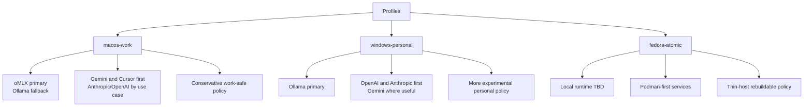

### macos-work

The `macos-work` profile is for my work laptop.

It should prioritise:

- approved work AI tools first
- local-first workflows where practical
- conservative routing
- work-safe policy
- architecture and writing workflows

Approved / first-use AI tools:

- Gemini
- Cursor

Additional providers depending on use case and approval context:

- Anthropic
- OpenAI

### windows-personal

The `windows-personal` profile is for my personal AI development lab.

It should prioritise:

- local experimentation
- vibe coding
- personal projects
- OpenAI and Anthropic as primary frontier escalation paths
- more experimental tools and agents over time

### fedora-atomic

The `fedora-atomic` profile is a future target for testing rebuildability on a more atomic or ephemeral Linux workstation model.

It should prioritise:

- thin host
- Podman-first services
- repeatable bootstrap
- minimal manual state
- user-space tools

---

## 9. Runtime and provider architecture

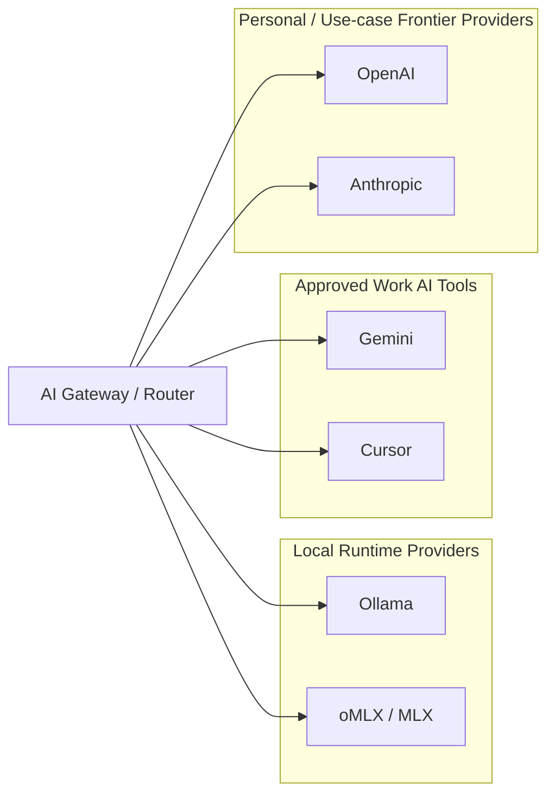

The gateway should hide provider-specific details from day-to-day workflows where practical.

For example, I should be able to use:

```bash
ask-ai --local "Summarise this note"
ask-ai --best "Help me reason through this design"
ai-route "Review this architecture decision"
```

without needing to remember which model is currently best for each task.

---

## 10. Routing architecture

Routing should be local-first, profile-aware and explainable.

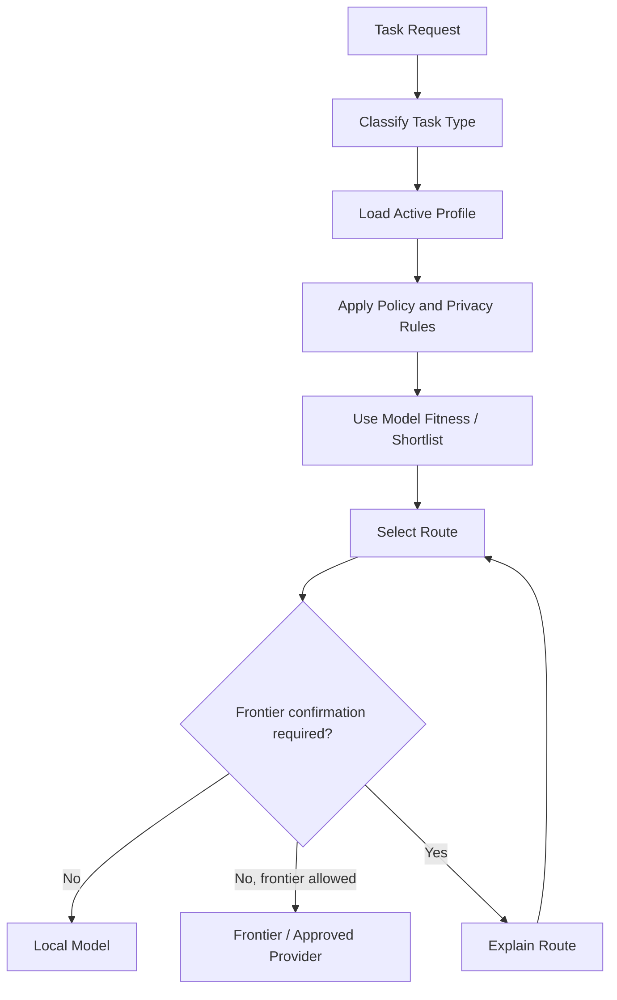

Initial routing does not need to be overly complex. The first implementation can be configuration-led and rule-based.

Routing should eventually consider:

- selected profile
- task type
- local runtime availability
- model fitness results
- data sensitivity
- approved tool posture
- frontier escalation rules
- user flags such as `--local`, `--best` and `--explain-route`

---
## 11. Gateway failure and degraded operation

The gateway is the preferred control point for model access, but it should not become a hard single point of failure for basic local use.

The workstation should support three operating modes:

| Mode | Description | Expected behaviour |
|---|---|---|
| Normal | Gateway is healthy and reachable. | CLI, UI, IDE tools and future agents use the gateway where practical. |
| Degraded local | Gateway is unavailable, but a local runtime is available. | Selected CLI commands may fall back to direct local runtime access where explicitly configured. |
| Degraded manual | Gateway is unavailable and no automated fallback is configured. | The CLI explains the failure and provides the next manual recovery step. |

The gateway-first principle still applies. Degraded local mode exists to keep the workstation usable during failure or rebuild scenarios, not to create a second hidden architecture.

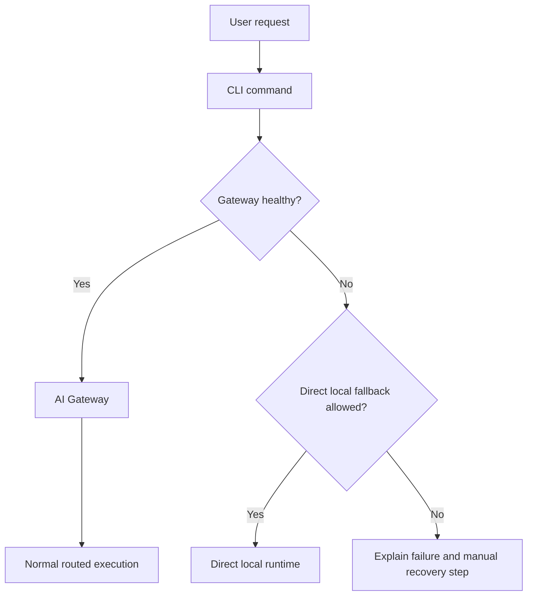

### Degraded local mode

Degraded local mode should be limited and explicit.

It may be supported for:

- `ask-ai --local`
- `ai-status`
- `ai-bootstrap-check`
- `ai-model-review`

It should not silently apply to:

- approved work AI tool routing
- frontier provider routing
- Open WebUI
- agents
- work-sensitive tasks

Example degraded local output:

```text
Gateway: unavailable
Profile: windows-personal
Requested route: local
Fallback: direct Ollama
Mode: degraded_local
```

### Degraded manual mode

If the gateway is unavailable and no fallback is configured, the workstation should fail clearly.

Example:

```text
Gateway: unavailable
Profile: macos-work
Fallback: not configured
Mode: degraded_manual

Next action:
- start the gateway service
- run ai-status for details
- use the documented direct runtime command if urgent
```

### Design constraints

- The gateway remains the default path.
- Direct local fallback must be profile-aware.
- Fallback should be local-only at first.
- Frontier fallback should not happen silently.
- Work profile fallback must remain conservative.
- Degraded mode should be visible in CLI output and routing logs.
- Validation should test both gateway health and configured fallback paths.

Related ADR:

```text
docs/adr/0008-gateway-failure-and-degraded-operation.md
```

---

## 12. Runtime access model

The workstation supports multiple local runtimes. The Windows personal profile is expected to use Ollama as the primary local runtime. The macOS work profile may use an oMLX / MLX-compatible runtime as the preferred Mac-native path, with Ollama as a fallback.

Because these runtimes may have different model formats, APIs, CLIs and configuration models, runtime access must be explicit.

The default access pattern is:

```text
tool or CLI command → gateway → runtime or provider
```

Direct runtime access is allowed only where documented.

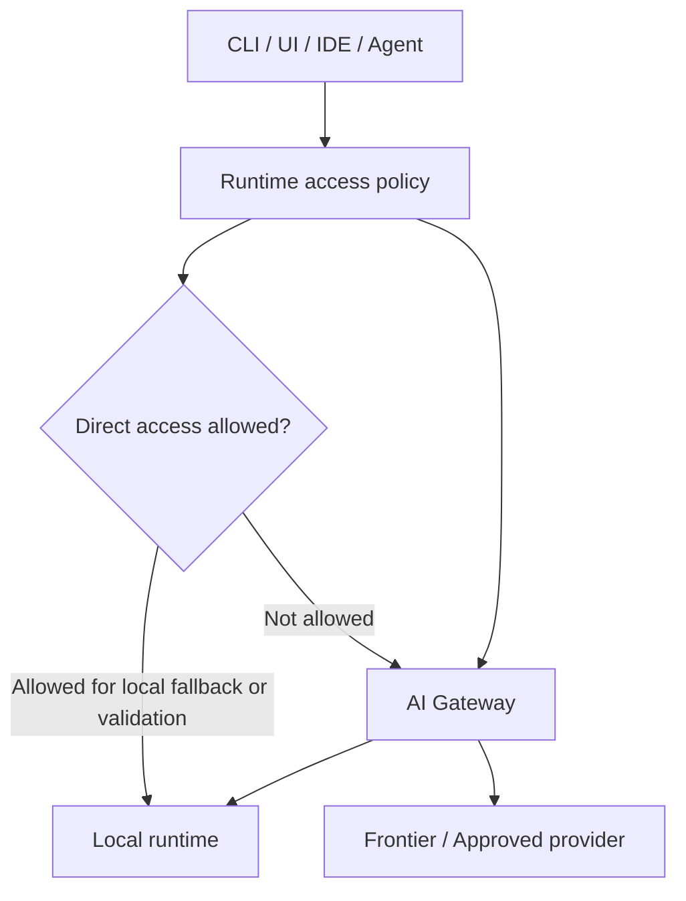

### Runtime access rules

| Tool / capability | Preferred access | Direct access allowed? | Notes |
|---|---|---:|---|
| `ask-ai` | Gateway | Yes, local fallback only | Used for degraded local mode. |
| `ai-route` | Config only | No | Explains route decisions; should not call runtimes. |
| `ai-status` | Gateway and direct health checks | Yes | Health checks may inspect runtimes directly. |
| `ai-bootstrap-check` | Gateway and direct health checks | Yes | Rebuild validation needs direct checks. |
| `ai-model-review` | Direct/runtime-specific or gateway-based | Yes | Model assessment may need direct runtime access. |
| Open WebUI | Gateway | No initially | Avoid creating a separate UI model path. |
| Aider / OpenCode | Gateway where practical | Yes, if required | Direct access must be documented per tool. |
| Goose / agents | Gateway | No initially | Agents need stronger controls. |
| RAG / project memory | Gateway | No initially | Retrieval may be local, but generation should route through policy. |

### Profile-level runtime policy

Profiles should declare their runtime access posture.

Example:

```yaml
runtime_access:
  default: gateway
  direct_local_fallback: true
  direct_frontier_fallback: false
  direct_allowed_for:
    - ai-status
    - ai-bootstrap-check
    - ai-model-review
```

For `macos-work`, direct runtime access should remain conservative:

```yaml
runtime_access:
  default: gateway
  direct_local_fallback: true
  direct_frontier_fallback: false
  direct_allowed_for:
    - ai-status
    - ai-bootstrap-check
    - ai-model-review
```

For `windows-personal`, direct local fallback can be more permissive for local experimentation:

```yaml
runtime_access:
  default: gateway
  direct_local_fallback: true
  direct_frontier_fallback: false
  direct_allowed_for:
    - ask-ai
    - ai-status
    - ai-bootstrap-check
    - ai-model-review
```

### macOS runtime split

The macOS profile needs special care because oMLX / MLX-compatible runtimes and Ollama may not share the same model format, CLI behaviour or integration model.

The architecture should avoid hiding this difference.

The profile should make clear:

- which runtime is preferred
- which runtime is fallback
- which model aliases map to each runtime
- which tools use the gateway
- which tools may use direct runtime access
- how validation checks both paths

Example:

```yaml
local_runtimes:
  preferred:
    - omlx
  fallback:
    - ollama

model_aliases:
  local_fast:
    provider: omlx
    model: tbd
  local_capable:
    provider: omlx
    model: tbd
  local_code:
    provider: ollama
    model: tbd
```

### Design constraints

- Gateway access is the default.
- Direct runtime access must be explicit.
- Direct frontier provider fallback is not allowed by default.
- Tools that bypass the gateway must be documented.
- Validation should detect gateway access and direct runtime access separately.
- Runtime-specific model aliases should be visible in config.
- Agents should not bypass the gateway initially.

Related ADR:

```text
docs/adr/0009-runtime-access-patterns.md
```

---

## 13. Rebuild architecture

The workstation should be recoverable from the repository.

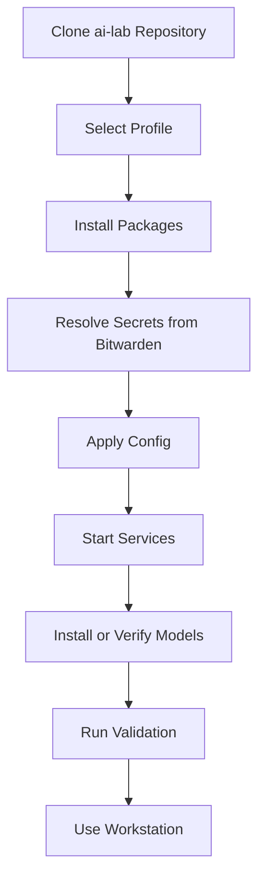

The target flow is:

```bash
git clone https://github.com/Deim0s13/ai-lab.git
cd ai-lab
./bootstrap/bootstrap.sh --profile macos-work
ai-bootstrap-check
```

Manual steps should be treated as technical debt and documented until automated.

---

## 14. Secrets architecture

Secrets must not be committed to the repository.

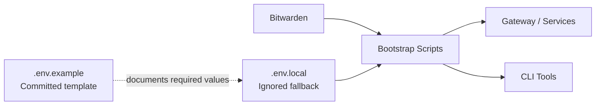

Bitwarden is the preferred secrets source.

`.env.local` may be used as an ignored local fallback, but it should not become the primary long-term pattern.

The architecture should avoid storing secrets in:

- committed files
- shell profiles
- bootstrap scripts
- container compose files
- routing configuration
- model configuration

---

## 15. Component model

The workstation is built around capabilities rather than fixed tools.

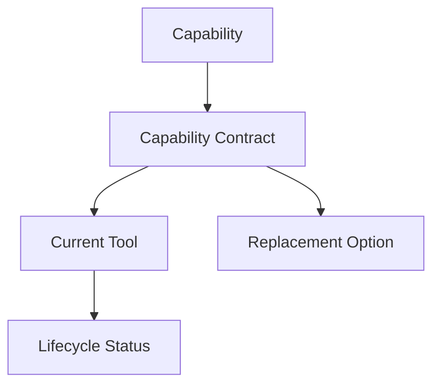

Examples:

| Capability | Current / Candidate Implementation |
|---|---|
| Model gateway | LiteLLM |
| Local runtime — Windows | Ollama |
| Local runtime — macOS | oMLX / MLX, Ollama fallback |
| Chat UI | Open WebUI |
| CLI coding assistant | Aider / OpenCode |
| Agent runner | Goose |
| Model fitness | llmfit |
| Secrets management | Bitwarden |

A tool can move through the lifecycle:

```text
Candidate → Trial → Adopted → Preferred → Deprecated → Removed
```

This allows me to experiment without turning the workstation into a messy collection of tools.

---

## Harness engineering lens

For coding and agent workflows, this project treats the model as only one part of the system.

The useful unit is:

```text
agent workflow = model + harness + environment
```

The harness includes:

- task specification
- context selection
- routing policy
- tool access
- permissions
- observability
- verification
- failure handling
- intervention points

This project will not introduce a separate harness platform during the early milestones. Instead, harness engineering is used as a design lens for the CLI, coding and agent workflows.

Relevant existing components include:

- docs/11-cli-interface-contracts.md
- docs/07-routing-strategy.md
- contexts/README.md
- tests/README.md
- docs/adr/0014-controlled-agent-guardrails.md

---

## 16. Repository architecture

The target repository structure is:

```text
ai-lab/
├── README.md
├── CHANGELOG.md
├── bootstrap/
├── profiles/
├── packages/
├── containers/
├── config/
├── contexts/
├── dotfiles/
├── tools/
├── systemd/
├── docs/
├── tests/
├── labs/
└── archive/
```

Key directories:

| Directory | Responsibility |
|---|---|
| `bootstrap/` | Setup and rebuild scripts |
| `profiles/` | Device-specific profiles |
| `packages/` | Package declarations |
| `containers/` | Gateway, Open WebUI and future service definitions |
| `config/` | Providers, routing, models, policies and capabilities |
| `contexts/` | Shared, work, personal and persona context |
| `tools/` | CLI wrappers and workstation commands |
| `tests/` | Validation and health checks |
| `docs/` | Architecture, principles, decisions and roadmap |
| `archive/` | Legacy material and historical experiments |

---

## 17. Initial implementation view

Milestone 1 focuses on the smallest useful gateway foundation.

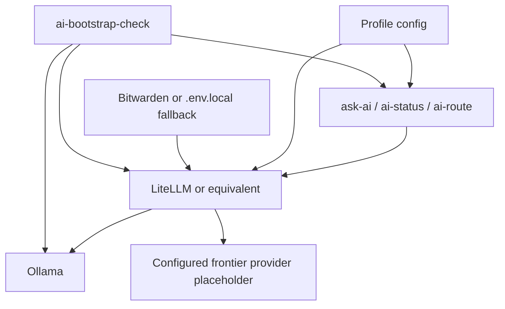

Milestone 1 should prove that:

- the repo structure works
- a profile can be selected
- the gateway can start
- at least one local provider can be reached
- frontier providers can be configured safely
- basic CLI commands can call the gateway
- validation can report health
- the setup can be rebuilt

---

## 18. Key architecture decisions

These decisions should be captured or expanded through ADRs:

| Decision | ADR |
|---|---|
| Use a gateway-first architecture | `docs/adr/0001-gateway-first.md` |
| Use open-source tools before building custom tools | `docs/adr/0002-open-source-first.md` |
| Treat the CLI as a first-class interface | `docs/adr/0003-cli-native.md` |
| Make the workstation rebuildable from code and config | `docs/adr/0004-rebuildable-by-default.md` |
| Build around composable and replaceable components | `docs/adr/0005-composable-and-replaceable.md` |
| Use local-first but frontier-capable routing | `docs/adr/0006-local-first-frontier-capable.md` |
| Separate work and personal behaviour through profiles | `docs/adr/0007-profile-based-work-personal-separation.md` |

Additional ADRs should be created for major tool decisions such as LiteLLM, Open WebUI, Bitwarden, Aider, OpenCode, Goose and oMLX.

---

## 19. Constraints and assumptions

### Constraints

- The project should be rebuildable.
- The work profile must respect approved AI tooling and data sensitivity.
- Secrets must not be committed.
- The CLI should remain a primary interface.
- The architecture should avoid unnecessary custom platform development.
- The system should remain understandable and maintainable.

### Assumptions

- The AI tooling landscape will continue to change quickly.
- Local models will improve and model choices will change.
- Some tools may be replaced over time.
- The workstation will be built incrementally.
- The first implementation does not need advanced semantic routing.
- Rebuildability and documentation are more important than speed.

---

## 20. Risks and mitigations

| Risk | Mitigation |
|---|---|
| Tool sprawl | Use capability contracts and component lifecycle. |
| Work/personal context mixing | Use profiles, context boundaries and routing policy. |
| Secrets leakage | Use Bitwarden, `.env.example`, ignored local fallback and validation. |
| Overbuilding too early | Use milestones and adopt-before-build principle. |
| Local models underperforming | Use llmfit and frontier escalation. |
| Gateway becomes too complex | Start with simple routing and evolve gradually. |
| UI and CLI drift apart | Route both through the same gateway where practical. |
| Project gets abandoned | Prioritise daily-use workflows and stable commands. |
| Gateway becomes a single point of failure | Define normal, degraded local and degraded manual modes; validate gateway health and fallback paths. |
| macOS runtime split creates drift | Make runtime access explicit; document gateway versus direct runtime access per tool and profile. |

---

## 21. Architecture summary

The architecture is designed around a simple idea:

```text
Stable workflows.
Replaceable components.
Rebuildable workstation.
```

The first milestone should build the control plane, not the entire future state.

Once the gateway, profile, routing, secrets and validation foundations are in place, the workstation can safely grow into coding workflows, Open WebUI parity, work personas, model fitness, controlled agents and future RAG/project memory.
