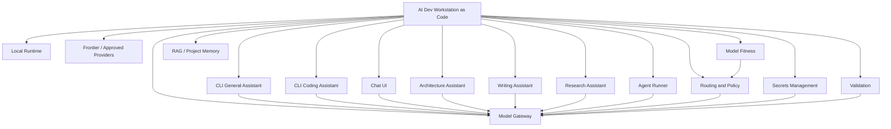

# Capability Contracts

## 1. Purpose

This document defines the capability model for **AI Dev Workstation as Code**.

I am using capability contracts so the workstation is designed around what it needs to do, not around whichever tool happens to be interesting at the time.

Tools will change. Capabilities should remain relatively stable.

The goal is:

```text id="oeodaj"
Define the capability.
Set the contract.
Select the current implementation.
Keep the implementation replaceable.
```

---

## 2. Capability principles

The capability model follows these principles:

| Principle | Meaning |
|---|---|
| Capabilities before tools | A tool is selected because it satisfies a capability, not because it is interesting. |
| Contracts before implementation | Each capability should have a clear contract before a tool becomes preferred. |
| Replaceable by design | A tool should be removable or replaceable without redesigning the workstation. |
| Profile-aware | Capabilities may behave differently across `macos-work`, `windows-personal` and future profiles. |
| Open-source-first | Active open-source tools should be considered before custom development. |
| Thin custom layer | Custom code should usually be wrappers, config loading, validation or glue logic. |
| Secure by default | Capabilities that use secrets, context or external providers must respect security and profile boundaries. |
| Daily use over novelty | A capability should support a real workflow, not just add another tool. |

---

## 3. Capability map



The gateway, routing, secrets, profiles and validation capabilities form the foundation. User-facing tools such as CLI assistants, chat UI, coding tools and agents should build on top of that foundation.

---

## 4. Capability contract template

Each capability is described using the following fields.

| Field | Purpose |
|---|---|
| Intent | Why the capability exists. |
| Contract | What the capability must provide. |
| Current candidate / implementation | The current tool or approach being considered or used. |
| Profile considerations | How the capability behaves across work, personal and future profiles. |
| Selection criteria | How I will assess whether the implementation is a good fit. |
| Replacement trigger | What would cause me to replace or revisit the current implementation. |
| Current status | Candidate, Trial, Adopted, Preferred, Deprecated, Removed or Future. |

---

## 5. Capability catalogue

| Capability | Current candidate / implementation | Status | Priority |
|---|---|---:|---:|
| Model Gateway | LiteLLM or equivalent | Candidate / Trial | High |
| Local Runtime — Windows | Ollama | Adopted | High |
| Local Runtime — macOS | oMLX / MLX-compatible runtime, Ollama fallback | Candidate | High |
| Frontier / Approved Providers | Gemini, Cursor, OpenAI, Anthropic | Candidate | High |
| Routing and Policy | YAML/config-led routing, profile policy | Planned | High |
| Secrets Management | Bitwarden, `.env.local` fallback | Preferred direction | High |
| CLI General Assistant | `ask-ai` | Planned | High |
| Validation | `ai-status`, `ai-bootstrap-check` | Planned | High |
| Model Fitness | llmfit | Candidate / Planned | High |
| Chat UI | Open WebUI | Candidate / Trial | Medium |
| CLI Coding Assistant | Aider / OpenCode | Candidate | Medium |
| Architecture Assistant | `architect-ai` | Planned | Medium |
| Writing Assistant | `write-ai` | Planned | Medium |
| Research Assistant | `research-ai` | Planned | Medium |
| Agent Runner | Goose or equivalent | Future candidate | Low initially |
| RAG / Project Memory | Not selected | Future | Low initially |

---

## 6. Capability contracts

### 6.1 Model Gateway

| Field | Contract |
|---|---|
| Intent | Provide a common control point for model access, routing, aliases and provider abstraction. |
| Contract | Must support multiple providers, local and frontier models, model aliases, configuration-driven behaviour, CLI access, UI access and OpenAI-compatible access where practical. |
| Current candidate / implementation | LiteLLM or equivalent. |
| Profile considerations | Must support both `macos-work` and `windows-personal` routing policies. Work profile routing must respect approved tool posture. |
| Selection criteria | Provider support, local runtime support, Gemini/OpenAI/Anthropic support, Open WebUI compatibility, CLI compatibility, maintainability, ease of local deployment and ease of replacement. |
| Replacement trigger | Better gateway emerges, current gateway blocks local/frontier routing, poor maintenance, poor profile support or too much operational complexity. |
| Current status | Candidate / Trial. |

---

### 6.2 Local Runtime — Windows

| Field | Contract |
|---|---|
| Intent | Provide local model execution for the Windows personal AI development lab. |
| Contract | Must support local model execution, API access, model management, GPU usage where available, WSL2 compatibility, gateway integration and repeatable setup. |
| Current candidate / implementation | Ollama. |
| Profile considerations | Used primarily by `windows-personal` for local experimentation, vibe coding, personal projects and model testing. |
| Selection criteria | Model availability, performance, GPU behaviour, WSL2 compatibility, gateway compatibility, CLI usability, installation repeatability and validation support. |
| Replacement trigger | Better local runtime appears, Ollama performance is insufficient, gateway integration becomes limiting, or GPU support is unreliable. |
| Current status | Adopted. |

---

### 6.3 Local Runtime — macOS

| Field | Contract |
|---|---|
| Intent | Provide local model execution for the MacBook Pro work profile, preferably using an Apple Silicon-friendly runtime. |
| Contract | Must support local model execution, good Apple Silicon performance where practical, CLI usability, gateway integration, repeatable setup and work-safe local usage. |
| Current candidate / implementation | oMLX / MLX-compatible runtime, with Ollama as fallback. |
| Profile considerations | Used by `macos-work`. Should support local-first architecture, writing, summarisation and low-risk coding assistance. |
| Selection criteria | Apple Silicon performance, model availability, API compatibility, gateway compatibility, stability, CLI usability and ease of rebuild. |
| Replacement trigger | Runtime is unstable, model support is too limited, gateway integration is poor, or another Mac-native runtime becomes clearly better. |
| Current status | Candidate. Ollama is a candidate fallback. |

---

### 6.4 Frontier / Approved Providers

| Field | Contract |
|---|---|
| Intent | Provide access to higher-capability AI tools and models when local models are not sufficient. |
| Contract | Must support deliberate frontier escalation, profile-aware usage, secure secrets handling, clear privacy posture and routing integration where practical. |
| Current candidate / implementation | Gemini, Cursor, OpenAI and Anthropic. |
| Profile considerations | `macos-work` should use Gemini and Cursor first as approved work AI tools. Anthropic and OpenAI may be used depending on use case, approval context, data sensitivity and routing policy. `windows-personal` can use OpenAI and Anthropic as primary frontier escalation paths, with Gemini where useful. |
| Selection criteria | Model quality, coding ability, reasoning capability, writing quality, profile fit, approval posture, privacy considerations, gateway compatibility, cost and key management through Bitwarden. |
| Replacement trigger | Provider approval changes, model quality changes, pricing changes, privacy posture changes, or a new provider becomes a better fit. |
| Current status | Candidate. |

---

### 6.5 Routing and Policy

| Field | Contract |
|---|---|
| Intent | Decide which model, provider or runtime should handle a task based on profile, task type, data sensitivity and requested quality. |
| Contract | Must support local-first defaults, explicit frontier escalation, profile-aware behaviour, route explanation, model aliases, fallback rules and simple configuration. |
| Current candidate / implementation | YAML/config-led routing to start. Semantic routing may be considered later. |
| Profile considerations | `macos-work` routing must be more conservative and approved-tool-aware. `windows-personal` can be more experimental and frontier-friendly. |
| Selection criteria | Simplicity, explainability, profile awareness, compatibility with gateway, ease of editing, support for `--local`, `--best` and `--explain-route`. |
| Replacement trigger | Rule-based routing becomes too limited, routing decisions become hard to explain, or profile policy cannot be expressed cleanly. |
| Current status | Planned. |

---

### 6.6 Secrets Management

| Field | Contract |
|---|---|
| Intent | Store and retrieve API keys and sensitive values securely without committing secrets to the repository. |
| Contract | Must support secure storage, CLI access where practical, cross-platform usage, rebuild-friendly setup, validation without exposing values and a simple local fallback. |
| Current candidate / implementation | Bitwarden as preferred source. `.env.local` as ignored local fallback only. |
| Profile considerations | Work and personal profiles may use different secrets or provider keys. Secrets must not be mixed accidentally. |
| Selection criteria | Security, CLI usability, macOS/Windows support, simplicity, integration with bootstrap scripts, validation support and low operational overhead. |
| Replacement trigger | Bitwarden CLI workflow is too awkward, Secrets Manager is a better fit, cross-platform use is poor, or project requirements grow beyond Bitwarden’s fit. |
| Current status | Preferred direction. |

---

### 6.7 CLI General Assistant

| Field | Contract |
|---|---|
| Intent | Provide the basic terminal-first AI entry point for daily use. |
| Contract | Must support gateway access, local-first default behaviour, explicit local route, explicit best/frontier-capable route, route explanation, profile awareness and simple command syntax. |
| Current candidate / implementation | `ask-ai`. |
| Profile considerations | Should behave differently depending on active profile. Work profile should respect approved tool posture and data sensitivity. |
| Selection criteria | Ease of use, memorable syntax, route explainability, gateway compatibility, scriptability, output quality and maintainability. |
| Replacement trigger | Command becomes too complex, a better CLI tool replaces the need for it, or gateway integration changes significantly. |
| Current status | Planned. |

---

### 6.8 Validation

| Field | Contract |
|---|---|
| Intent | Prove that the workstation is installed, configured and healthy after setup or rebuild. |
| Contract | Must check profile selection, packages, services, gateway health, local runtime health, provider availability, secrets availability, model availability and CLI command availability. |
| Current candidate / implementation | `ai-status` and `ai-bootstrap-check`. |
| Profile considerations | Validation must be profile-aware. `macos-work` and `windows-personal` will have different expected runtimes, providers and tools. |
| Selection criteria | Clarity of output, useful failure messages, profile awareness, ease of execution, maintainability and support for troubleshooting. |
| Replacement trigger | Validation becomes too shallow, too noisy, hard to maintain or unable to reflect real profile requirements. |
| Current status | Planned. |

---

### 6.9 Model Fitness

| Field | Contract |
|---|---|
| Intent | Inform model selection based on actual device and task fit. |
| Contract | Must assess model suitability, capture repeatable results, support device-specific model shortlists and inform routing aliases over time. |
| Current candidate / implementation | llmfit. |
| Profile considerations | Results should be captured per device/profile. Windows and macOS model recommendations may differ. |
| Selection criteria | Hardware awareness, useful model guidance, output clarity, repeatability, CLI usability and usefulness for routing decisions. |
| Replacement trigger | llmfit does not provide useful guidance, does not fit the local runtimes, or a better model assessment process emerges. |
| Current status | Candidate / Planned. |

---

### 6.10 Chat UI

| Field | Contract |
|---|---|
| Intent | Provide a browser-based interface to the same model layer used by the CLI. |
| Contract | Must support self-hosted operation, gateway integration, local and frontier model access, repeatable setup and clear data/storage behaviour. |
| Current candidate / implementation | Open WebUI. |
| Profile considerations | Should not become a separate AI environment. It should use the same gateway and profile-aware model layer where practical. |
| Selection criteria | Gateway compatibility, container support, usability, local/frontier access, persistence behaviour, configuration model and rebuildability. |
| Replacement trigger | UI is hard to maintain, does not work cleanly with the gateway, stores data in an undesirable way or a better UI emerges. |
| Current status | Candidate / Trial. |

---

### 6.11 CLI Coding Assistant

| Field | Contract |
|---|---|
| Intent | Support terminal-native coding, code explanation, code generation, code editing and test-fix workflows. |
| Contract | Must support repo-aware coding, safe file modification, local and frontier models, CLI usage, repeatable installation and gateway compatibility where practical. |
| Current candidate / implementation | Aider and OpenCode. |
| Profile considerations | `windows-personal` can be more experimental. `macos-work` should stay more conservative and aligned to approved work posture. |
| Selection criteria | CLI experience, repo awareness, local model support, frontier provider support, safety, gateway compatibility, install repeatability and fit with existing Claude Code habits. |
| Replacement trigger | Tool does not fit the CLI workflow, file editing feels unsafe, local model support is poor, or a better coding assistant emerges. |
| Current status | Candidate. |

---

### 6.12 Architecture Assistant

| Field | Contract |
|---|---|
| Intent | Support architecture thinking, option analysis, decision review, customer preparation and structured reasoning. |
| Contract | Must support CLI usage, architecture persona/context, profile-aware routing, local-first behaviour, approved-tool-first posture on work profile and deliberate frontier escalation. |
| Current candidate / implementation | `architect-ai` wrapper over the gateway. |
| Profile considerations | Most relevant to `macos-work`. Must respect work-safe routing and approved tool posture. |
| Selection criteria | Output quality, architecture usefulness, context handling, profile safety, route explainability and CLI ergonomics. |
| Replacement trigger | Workflow is not useful in real architecture work, context handling is poor, or another tool provides a better stable interface. |
| Current status | Planned. |

---

### 6.13 Writing Assistant

| Field | Contract |
|---|---|
| Intent | Support writing, rewriting, summarising, tone refinement and reusable drafting workflows. |
| Contract | Must support CLI usage, local-first rewriting, optional frontier escalation, writing style context, profile-aware behaviour and output saving. |
| Current candidate / implementation | `write-ai` wrapper over the gateway. |
| Profile considerations | Work and personal writing should use different context boundaries and routing rules. |
| Selection criteria | Rewrite quality, tone control, local model usefulness, profile safety, route control and ease of use. |
| Replacement trigger | Output quality is poor, style control is weak, routing is unclear, or a better writing workflow emerges. |
| Current status | Planned. |

---

### 6.14 Research Assistant

| Field | Contract |
|---|---|
| Intent | Support topic exploration, comparison, synthesis and structured research workflows. |
| Contract | Must support local summarisation, frontier escalation for synthesis where justified, source capture where applicable, profile-aware behaviour and future agent/RAG compatibility. |
| Current candidate / implementation | `research-ai` wrapper initially; future constrained agent workflow possible. |
| Profile considerations | Work research must respect data sensitivity and approved provider posture. Personal research can be more experimental. |
| Selection criteria | Usefulness for real research tasks, source handling, local/frontier balance, profile safety, CLI ergonomics and future agent compatibility. |
| Replacement trigger | Workflow does not add value over existing tools, source handling is weak, or RAG/agent capability changes the design. |
| Current status | Planned. |

---

### 6.15 Agent Runner

| Field | Contract |
|---|---|
| Intent | Support future multi-step workflows for coding, research, writing, architecture review and project memory. |
| Contract | Must support CLI usage, provider flexibility, constrained workflows, explicit permissions, observable execution, local/frontier model options and profile-aware safety controls. |
| Current candidate / implementation | Goose or equivalent. |
| Profile considerations | Agents should be more restricted on `macos-work` and more experimental on `windows-personal`. |
| Selection criteria | CLI experience, provider support, local model support, permission model, safety controls, workflow ergonomics, gateway fit and rebuildability. |
| Replacement trigger | Tool permissions are too broad, gateway integration is poor, workflows are unreliable, or a better constrained agent runner emerges. |
| Current status | Future candidate. |

---

### 6.16 RAG / Project Memory

| Field | Contract |
|---|---|
| Intent | Allow the workstation to answer questions from local notes, project documents, repository documentation and selected context. |
| Contract | Must support local document indexing, retrieval, embedding support, profile-aware context boundaries, rebuildable data/index strategy and CLI/agent integration. |
| Current candidate / implementation | Not selected. |
| Profile considerations | Work and personal indexes must remain separate. Work context must not leak into personal workflows. |
| Selection criteria | Local-first operation, privacy boundaries, data storage model, rebuildability, embedding support, CLI/API integration and simplicity. |
| Replacement trigger | Selected tool becomes too complex, context boundaries are weak, storage model is poor, or local-first operation is not practical. |
| Current status | Future. |

---

## 7. Cross-cutting requirements

Some requirements apply across multiple capabilities.

| Requirement | Applies to | Notes |
|---|---|---|
| Profile awareness | Gateway, routing, CLI, providers, agents, RAG | Behaviour must differ between work and personal profiles. |
| Secure secrets | Gateway, providers, bootstrap, validation | Bitwarden is preferred; committed secrets are not allowed. |
| Rebuildability | All capabilities | Setup should be repeatable from the repo where practical. |
| CLI usability | Gateway, assistants, validation, model fitness, agents | CLI is a first-class interface. |
| Replaceability | All tools | Tools should be replaceable without redesigning the workstation. |
| Observability | Routing, gateway, validation, agents | The system should explain route and health decisions. |
| Local-first | Routing, CLI, assistants, agents | Local models should be preferred where appropriate. |
| Approved-tool posture | Work profile providers and workflows | `macos-work` should prioritise Gemini and Cursor first. |
| Component lifecycle | All capabilities | Tools should move through Candidate, Trial, Adopted, Preferred, Deprecated and Removed states. |

---

## 8. Capability lifecycle alignment

Each capability implementation should align with the component lifecycle:

```text id="io7t5z"
Candidate → Trial → Adopted → Preferred → Deprecated → Removed
```

The lifecycle is documented in:

```text id="sp7q6t"
docs/05-component-lifecycle.md
```

Capability contracts should help answer:

- Is this tool only a candidate?
- Is it being trialled against a real workflow?
- Has it become part of the standard build?
- Is it preferred for a profile or capability?
- Should it be deprecated?
- Can it be removed safely?

---

## 9. Review process

When I consider a new tool or change, I should review it against the relevant capability contract.

Questions to ask:

- What capability does this tool satisfy?
- Does this capability already have an implementation?
- Is this a replacement, complement or experiment?
- Does it support the active profiles?
- Does it support CLI usage?
- Does it support local and frontier usage where needed?
- Does it integrate with the gateway?
- Does it create new security, privacy or secrets concerns?
- Can it be installed and rebuilt consistently?
- Can it be removed cleanly?
- Does it support a real recurring workflow?

The goal is not to collect tools.

The goal is to build durable workstation capability.

---

## 10. Summary

The capability model keeps the workstation modular and maintainable.

The guiding rule is:

```text id="x5s9z5"
Capabilities stay stable.
Tools can change.
Contracts guide the change.
```
