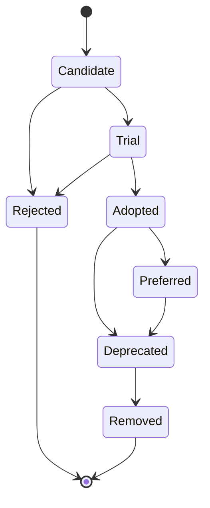
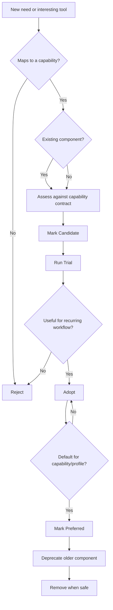

# Component Lifecycle

## 1. Purpose

This document defines how tools, runtimes, providers, services and custom scripts move through the **AI Dev Workstation as Code** lifecycle.

I want the workstation to stay useful and maintainable as AI tooling changes. That means I need a clear way to trial tools, adopt them, replace them and remove them without letting the repo turn into a pile of abandoned experiments.

The lifecycle is intended to support three things:

```text id="8f5mt3"
Experiment safely.
Adopt deliberately.
Remove cleanly.
```

---

## 2. What counts as a component

A component is any tool, service, runtime, provider or project-specific script that implements part of the workstation.

Examples include:

| Component type | Examples |
|---|---|
| Model gateway | LiteLLM or equivalent |
| Local runtime | Ollama, oMLX / MLX-compatible runtime |
| Frontier / approved provider | Gemini, Cursor, OpenAI, Anthropic |
| Chat UI | Open WebUI |
| CLI coding assistant | Aider, OpenCode |
| Agent runner | Goose |
| Model fitness tool | llmfit |
| Secrets tool | Bitwarden CLI / Secrets Manager CLI |
| Custom command | `ask-ai`, `ai-route`, `ai-status`, `ai-bootstrap-check` |
| Containerised service | Gateway, Open WebUI, future vector database |
| Configuration model | Routing config, provider config, profile config |

Components are different from capabilities.

A capability describes what the workstation needs to do.  
A component is the current implementation of that capability.

---

## 3. Lifecycle model



The standard lifecycle is:

```text id="f8frrq"
Candidate → Trial → Adopted → Preferred → Deprecated → Removed
```

`Rejected` is used when a tool is assessed but not taken forward.

---

## 4. Lifecycle states

| State | Meaning |
|---|---|
| Candidate | A tool or component looks relevant and may be assessed. |
| Trial | I am actively testing it against a real workflow. |
| Adopted | It is part of the workstation build or regular workflow. |
| Preferred | It is the default implementation for a capability or profile. |
| Deprecated | It is still present but should be replaced or removed. |
| Removed | It has been removed from the active workstation. |
| Rejected | It was considered but not taken forward. |

---

## 5. Lifecycle criteria

### Candidate

A component can be marked as **Candidate** when it appears to satisfy a capability or may solve a known problem.

Typical evidence:

- it maps to a defined capability
- it appears actively maintained
- it has useful documentation
- it supports CLI, API or config-driven usage
- it looks compatible with the target profiles
- it does not obviously conflict with security or rebuildability principles

Candidate components should not be treated as standard parts of the workstation yet.

---

### Trial

A component moves to **Trial** when I am testing it against a real workflow.

A trial should have:

- a defined capability
- a specific use case
- an expected outcome
- clear install steps
- basic configuration
- notes on what worked and what did not
- a decision point

Examples:

| Component | Trial workflow |
|---|---|
| LiteLLM | Can CLI and Open WebUI route through a common gateway? |
| Open WebUI | Can the chat UI use the same gateway as the CLI? |
| Aider | Can it support local-first coding workflows? |
| llmfit | Can it produce useful model shortlists per device? |
| Goose | Can it run constrained agent workflows safely? |

A trial should not become permanent just because it was installed.

---

### Adopted

A component becomes **Adopted** when it is useful enough to become part of the standard workstation.

Adoption requires:

- it supports a real recurring workflow
- it can be installed or configured repeatably
- it has a documented role
- it fits the relevant capability contract
- it does not create unacceptable security or privacy issues
- it can be validated or checked in some way
- it has a clear removal path

Adopted components should appear in the relevant docs, config or bootstrap process.

---

### Preferred

A component becomes **Preferred** when it is the default implementation for a capability or profile.

Preferred status means:

- it is the current recommended choice
- it is part of the normal workstation build
- other components are compared against it
- replacement requires a deliberate decision
- it should have clear documentation and validation

Examples might become:

| Capability | Preferred component |
|---|---|
| Windows local runtime | Ollama |
| Secrets management | Bitwarden |
| Model gateway | LiteLLM, if trial succeeds |
| Chat UI | Open WebUI, if trial succeeds |

Preferred does not mean permanent. It means this is the best current fit.

---

### Deprecated

A component becomes **Deprecated** when it is still present but should no longer be used for new workflows.

Reasons include:

- better replacement selected
- poor maintenance
- weak profile support
- poor gateway compatibility
- security or privacy concern
- too much operational overhead
- no longer supports a recurring workflow
- no longer aligns with the architecture principles

Deprecated components should have:

- a reason for deprecation
- a replacement path if applicable
- a removal target or trigger
- any migration notes needed

---

### Removed

A component becomes **Removed** when it is no longer part of the active workstation.

Before removal, I should check:

- whether any profile still references it
- whether any CLI command depends on it
- whether any docs still describe it as active
- whether any config, container, package or bootstrap file still includes it
- whether any archived notes should be retained

Removal should be clean, but historical context can stay in the archive or ADRs.

---

### Rejected

A component is **Rejected** when it has been considered but not taken forward.

Reasons may include:

- poor fit to the capability
- inactive project
- too much complexity
- poor CLI support
- weak gateway integration
- security concern
- conflicts with work profile posture
- not useful enough for a recurring workflow

Rejected components do not need long documentation, but a short note can prevent revisiting the same option later.

---

## 6. Component record

When a component becomes more than a casual idea, it should have a simple record.

The record can live in:

```text id="pjvrd1"
docs/components/
```

or inside the relevant capability, ADR or tool selection document until a separate directory is needed.

Suggested format:

```yaml id="v16noe"
name: LiteLLM
capability: Model Gateway
status: Candidate
profiles:
  - macos-work
  - windows-personal
current_role: Common model gateway and provider abstraction
why_considered:
  - Multi-provider gateway
  - OpenAI-compatible endpoint
  - Works with local and frontier providers
selection_criteria:
  - Open WebUI compatibility
  - CLI compatibility
  - Local runtime support
  - Gemini/OpenAI/Anthropic support
  - Simple local deployment
risks:
  - Additional moving part
  - Configuration complexity
replacement_trigger:
  - Better gateway emerges
  - Poor local runtime support
  - Too much operational overhead
review_date: 2026-09-30
```

This does not need to become heavy. The goal is to avoid losing track of why a component exists.

---

## 7. Lifecycle decision flow



---

## 8. Adoption checklist

Before marking a component as **Adopted**, I should be able to answer:

| Question | Required? |
|---|---:|
| What capability does it implement? | Yes |
| What workflow does it support? | Yes |
| Which profiles use it? | Yes |
| Can it be installed repeatably? | Yes |
| Can it be configured from the repo? | Yes |
| Does it need secrets? | Yes |
| If it needs secrets, are they managed securely? | Yes |
| Can it be validated? | Yes |
| Can it be removed cleanly? | Yes |
| Does it align to the architecture principles? | Yes |
| Is it useful enough for regular use? | Yes |

A tool should not be adopted simply because it is interesting.

---

## 9. Deprecation checklist

Before deprecating a component, I should capture:

| Question | Notes |
|---|---|
| Why is it being deprecated? | Better tool, poor fit, unused, security concern, etc. |
| What replaces it? | Replacement component or none. |
| Which profiles are affected? | Work, personal, future Linux. |
| What needs to change? | Config, docs, scripts, containers, packages, tests. |
| What is the removal trigger? | Date, milestone, successful migration, no remaining references. |
| What should be archived? | Notes, ADRs, previous config, lessons learned. |

Deprecation should be explicit so the repo does not accumulate stale components.

---

## 10. Relationship to ADRs

Not every component lifecycle change needs an ADR.

An ADR is useful when the decision:

- changes the architecture direction
- selects a major default tool
- changes the gateway, routing or profile strategy
- changes security or secrets handling
- introduces a meaningful trade-off
- could be questioned later
- replaces a previously preferred component

Examples that likely need ADRs:

| Decision | ADR? |
|---|---:|
| Gateway-first architecture | Yes |
| Bitwarden as preferred secrets source | Yes |
| LiteLLM as preferred gateway | Yes, if adopted/preferred |
| Open WebUI as chat UI | Maybe |
| Trying Aider for a week | No |
| Replacing Ollama with another runtime | Yes |
| Removing an unused experiment | No |

ADRs preserve decision history. Component records track implementation status.

---

## 11. Review rhythm

The component lifecycle should be reviewed periodically.

A lightweight review is enough.

Suggested review points:

| Review point | What to check |
|---|---|
| After each milestone | Did any candidates become adopted or rejected? |
| Before adding a new tool | Does it map to a capability? |
| Before changing profiles | Are profile-specific components still correct? |
| After model fitness review | Should model or runtime choices change? |
| When a tool becomes painful | Should it be deprecated or replaced? |
| Quarterly or ad hoc | Is the workstation accumulating unused components? |

---

## 12. Initial lifecycle view

Current expected lifecycle view:

| Component | Capability | Initial status |
|---|---|---:|
| Ollama | Local Runtime — Windows | Adopted |
| oMLX / MLX-compatible runtime | Local Runtime — macOS | Candidate |
| Ollama on macOS | Local Runtime fallback | Candidate |
| LiteLLM | Model Gateway | Candidate / Trial |
| Open WebUI | Chat UI | Candidate / Trial |
| Bitwarden | Secrets Management | Preferred direction |
| llmfit | Model Fitness | Candidate / Planned |
| Aider | CLI Coding Assistant | Candidate |
| OpenCode | CLI Coding Assistant | Candidate |
| Goose | Agent Runner | Future candidate |
| `ask-ai` | CLI General Assistant | Planned |
| `ai-route` | Routing Explanation | Planned |
| `ai-status` | Validation | Planned |
| `ai-bootstrap-check` | Validation | Planned |

This table should evolve as the project moves from design into implementation.

---

## 13. Summary

The lifecycle keeps the workstation from becoming cluttered.

The rule is:

```text id="07k5uo"
Do not just add tools.
Trial them against a capability.
Adopt them deliberately.
Replace them cleanly.
Remove them when they no longer earn their place.
```
