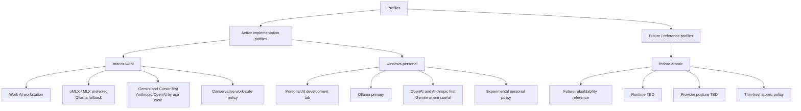
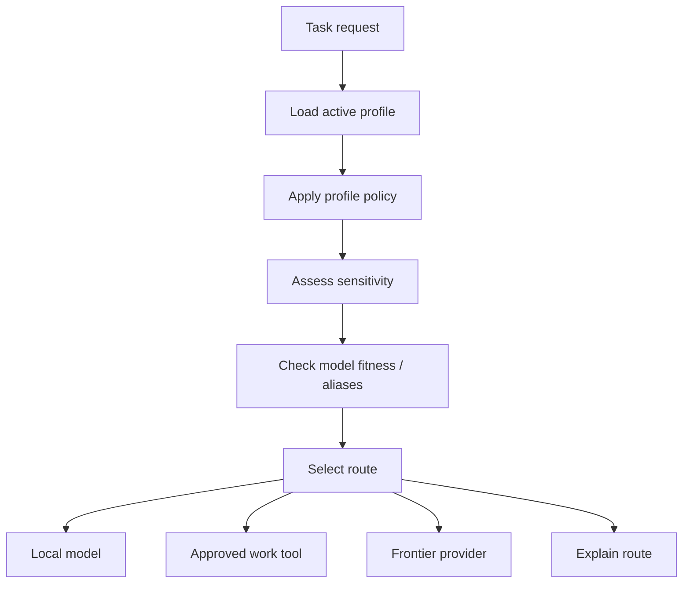
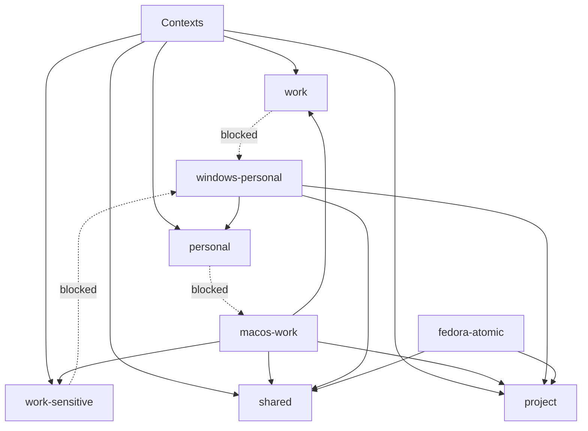

# Profiles

## 1. Purpose

This document defines the profile model for **AI Dev Workstation as Code**.

Profiles allow the same workstation architecture to behave differently depending on the device, use case, approval context and level of experimentation.

I do not want the MacBook Pro work setup, Windows personal lab and future atomic Linux environment to all behave the same way. They should share the same design patterns, but they need different defaults, providers, policies and enabled capabilities.

The profile model exists to make that explicit.

---

## 2. Profile principles

| Principle | Meaning |
|---|---|
| Same architecture, different behaviour | Profiles share the same overall architecture but apply different defaults and policies. |
| Work and personal separation | Work context, providers and tooling posture must not accidentally mix with personal experimentation. |
| Local-first by default | Each profile should use local models where appropriate. |
| Profile-aware escalation | Frontier escalation should depend on profile, use case and approval context. |
| Approved-tool posture for work | The work profile should prioritise approved AI tools first. |
| Experimentation belongs in personal profiles | Experimental tools and agents should start in the personal profile, not the work profile. |
| Rebuildable per device | Each profile should be able to drive bootstrap, configuration and validation. |
| Config over assumption | Profile behaviour should be expressed in configuration, not hidden in scripts. |

---

## 3. Initial profile map



The initial profile status is:

| Profile | Status | Device / environment | Primary purpose |
|---|---|---|---|
| `macos-work` | Active | MacBook Pro | Work AI workstation |
| `windows-personal` | Active | Windows laptop / WSL2 | Personal AI development lab |
| `fedora-atomic` | Future / reference | Future Linux target | Rebuildable atomic workstation pattern |

Only the active profiles are expected to be implemented during the first milestones.

`fedora-atomic` is intentionally retained as a future reference profile. It keeps the architecture honest about rebuildability, thin-host design and Podman-first services, but it is not an active Milestone 1 implementation target.

Related ADR:

```text id="yt8e6i"
docs/adr/0015-fedora-atomic-profile-status.md
```

---

## 5. Profile: `macos-work`

### Intent

`macos-work` is the profile for my MacBook Pro work device.

This profile should support architecture work, writing, summarisation, customer preparation, local-first assistance and work-safe AI routing.

It should be conservative by default because it may involve work context, customer context or material that needs to respect approved AI tooling and data sensitivity.

### Primary use cases

| Use case | Notes |
|---|---|
| Architecture thinking | Option analysis, patterns, customer scenarios, platform decisions |
| Writing and summarisation | Drafting, refining, summarising, restructuring |
| Customer preparation | Notes, talking points, discovery framing |
| Local-first coding help | Explanations, low-risk snippets, learning |
| Work-safe research support | Synthesis where data sensitivity allows |
| Model fitness review | Assess what runs well on the MBP |

### Local runtime posture

Preferred local runtime:

```text id="dt9lje"
oMLX / MLX-compatible runtime
```

Fallback runtime:

```text id="ux5iam"
Ollama
```

The Mac profile should favour a Mac-native runtime if it provides better Apple Silicon performance and a good workflow. Ollama remains useful as a compatibility fallback, particularly where tools expect an Ollama-compatible interface or where model availability is better.

### Frontier / approved AI posture

Approved / first-use AI tools:

- Gemini
- Cursor

Additional providers depending on use case, data sensitivity, approval context and routing policy:

- Anthropic
- OpenAI

This wording is deliberate. For the work profile, the documented first port of call should be approved tools. Anthropic and OpenAI may still have a place depending on the use case, but they should not be presented as the default work route.

### Policy posture

| Area | Policy |
|---|---|
| Default route | Local where appropriate |
| Work-approved tools | Gemini and Cursor first |
| Anthropic/OpenAI | Use-case dependent |
| Agents | Disabled or highly restricted initially |
| RAG/project memory | Future, with strict work/personal separation |
| Secrets | Bitwarden preferred |
| Data sensitivity | Conservative |
| Experimental tools | Avoid by default |

### Enabled capabilities

Initial:

- local runtime
- model gateway
- routing and policy
- secrets management
- CLI general assistant
- validation
- model fitness

Later:

- Open WebUI
- architecture assistant
- writing assistant
- limited coding assistant
- limited research assistant

Restricted or future:

- agents
- RAG / project memory
- experimental coding automation

### Example profile configuration

```YAML
name: macos-work
description: Work AI workstation profile for MacBook Pro
status: active

device:
  os: macos
  role: work
  risk_posture: conservative

local_runtimes:
  preferred:
    - omlx
  fallback:
    - ollama

runtime_access:
  default: gateway
  direct_local_fallback: true
  direct_frontier_fallback: false
  direct_allowed_for:
    - ai-status
    - ai-bootstrap-check
    - ai-model-review

providers:
  approved_first:
    - gemini
    - cursor
  use_case_dependent:
    - anthropic
    - openai

routing:
  default: local_first
  explain_routes: true
  require_confirmation_for_frontier: true
  approved_tools_first: true
  block_frontier_for:
    - restricted

capabilities:
  enabled:
    - model_gateway
    - local_runtime
    - routing_policy
    - secrets_management
    - cli_general_assistant
    - validation
    - model_fitness
  planned:
    - chat_ui
    - architecture_assistant
    - writing_assistant
    - cli_coding_assistant
    - research_assistant
  restricted:
    - agent_runner
    - rag_project_memory

secrets:
  source: bitwarden
  fallback: env_local
  required:
    - GEMINI_API_KEY
  optional:
    - ANTHROPIC_API_KEY
    - OPENAI_API_KEY

context:
  allowed:
    - work
    - work-sensitive
    - shared
    - project
  blocked:
    - personal

notes:
  - Gemini and Cursor are documented as the first-use AI tools for work profile.
  - Anthropic and OpenAI are use-case dependent and subject to approval context.
  - Direct runtime access is limited to validation and model review workflows.
```

---

## 6. Profile: `windows-personal`

### Intent

`windows-personal` is the profile for my Windows personal AI development lab.

This profile should support personal projects, vibe coding, local model experimentation, routing experiments and future agent workflows.

It can have a more experimental posture than the work profile because it is not the primary work device.

### Primary use cases

| Use case | Notes |
|---|---|
| Personal AI development | Build and test workstation capabilities |
| Vibe coding | Coding experiments and repo workflows |
| Local model testing | Compare local models and runtimes |
| Routing experiments | Test local/frontier routing behaviour |
| Agent experiments | Trial constrained agent workflows later |
| Model fitness review | Assess what the Windows GPU can run well |

### Local runtime posture

Primary local runtime:

```text id="hdtdjb"
Ollama
```

The Windows profile should use Ollama as the primary local model runtime, especially where WSL2 and local GPU support are available.

### Frontier provider posture

Primary frontier escalation paths:

- OpenAI
- Anthropic

Additional provider where useful:

- Gemini

The Windows profile is the better place to experiment with OpenAI and Anthropic as primary frontier providers, particularly for coding, development, reasoning and personal project workflows.

### Policy posture

| Area | Policy |
|---|---|
| Default route | Local where appropriate |
| Primary frontier providers | OpenAI and Anthropic |
| Gemini | Available where useful |
| Agents | Candidate for later experimentation |
| RAG/project memory | Future personal project capability |
| Secrets | Bitwarden preferred |
| Data sensitivity | Personal context only |
| Experimental tools | Allowed, but tracked through lifecycle |

### Enabled capabilities

Initial:

- local runtime
- model gateway
- routing and policy
- secrets management
- CLI general assistant
- validation
- model fitness

Next:

- CLI coding assistant
- Open WebUI
- development workflows

Later:

- agent runner
- research assistant
- RAG / project memory

### Example profile configuration

```YAML
name: windows-personal
description: Personal AI development lab profile for Windows and WSL2
status: active

device:
  os: windows
  subsystem: wsl2
  role: personal
  risk_posture: experimental

local_runtimes:
  preferred:
    - ollama

runtime_access:
  default: gateway
  direct_local_fallback: true
  direct_frontier_fallback: false
  direct_allowed_for:
    - ask-ai
    - ai-status
    - ai-bootstrap-check
    - ai-model-review

providers:
  primary_frontier:
    - openai
    - anthropic
  optional:
    - gemini

routing:
  default: local_first
  explain_routes: true
  require_confirmation_for_frontier: false
  allow_experimental_routes: true

capabilities:
  enabled:
    - model_gateway
    - local_runtime
    - routing_policy
    - secrets_management
    - cli_general_assistant
    - validation
    - model_fitness
  planned:
    - chat_ui
    - cli_coding_assistant
    - architecture_assistant
    - writing_assistant
    - research_assistant
  future:
    - agent_runner
    - rag_project_memory

secrets:
  source: bitwarden
  fallback: env_local
  required:
    - OPENAI_API_KEY
    - ANTHROPIC_API_KEY
  optional:
    - GEMINI_API_KEY

context:
  allowed:
    - personal
    - shared
    - project
  blocked:
    - work
    - work-sensitive

notes:
  - This profile is the main place for OpenAI and Anthropic frontier experimentation.
  - Work and work-sensitive context must not be available to this profile by default.
  - Experimental components should still be tracked through the component lifecycle.
```

---

## 7. Profile: `fedora-atomic`

### Intent

`fedora-atomic` is a future target profile for testing the workstation against a more rebuildable Linux operating model.

This profile is not the first implementation target, but it influences the architecture because it encourages a thin-host, container-first and repeatable-bootstrap design.

### Primary use cases

| Use case | Notes |
|---|---|
| Rebuildability test | Prove the repo can recreate the environment |
| Atomic desktop workflow | Test thin-host assumptions |
| Podman-first services | Run gateway, UI and future services cleanly |
| User-space tooling | Avoid unnecessary host mutation |
| Future Linux workstation | Validate cross-platform design |

### Runtime posture

Runtime is not yet selected.

Potential options:

- Ollama
- container-compatible local runtime
- hardware-specific runtime depending on future device

### Policy posture

| Area | Policy |
|---|---|
| Default route | Local where appropriate |
| Services | Podman-first |
| Host changes | Minimise |
| Secrets | Bitwarden preferred or Linux-compatible equivalent |
| Agents | Future |
| RAG/project memory | Future |
| Experimental tools | Allowed only if rebuildable |

### Enabled capabilities

Future baseline:

- model gateway
- local runtime
- routing and policy
- secrets management
- validation
- model fitness
- Open WebUI

### Example profile configuration

```YAML
name: fedora-atomic
description: Future reference profile for an atomic Linux workstation pattern
status: future_reference

device:
  os: fedora-atomic
  role: future
  risk_posture: controlled-experimental

local_runtimes:
  preferred:
    - tbd

runtime_access:
  default: gateway
  direct_local_fallback: false
  direct_frontier_fallback: false
  direct_allowed_for:
    - ai-status
    - ai-bootstrap-check

providers:
  primary_frontier:
    - tbd

routing:
  default: local_first
  explain_routes: true
  require_confirmation_for_frontier: true

capabilities:
  planned:
    - model_gateway
    - local_runtime
    - routing_policy
    - secrets_management
    - cli_general_assistant
    - validation
    - model_fitness
    - chat_ui
  future:
    - cli_coding_assistant
    - agent_runner
    - rag_project_memory

secrets:
  source: bitwarden
  fallback: env_local

context:
  allowed:
    - shared
    - project
  blocked:
    - work-sensitive

host_model:
  pattern: thin_host
  services: podman_first
  manual_state: minimise

notes:
  - This is a future/reference profile, not an active Milestone 1 implementation target.
  - It exists to keep the architecture honest about rebuildability.
  - Validation should not fail during Milestone 1 because this profile is not implemented.
```

---

## 8. Profile-driven routing

Routing decisions should use the active profile.



Examples:

| Profile | Request | Preferred route |
|---|---|---|
| `macos-work` | Summarise work notes | Local model if appropriate |
| `macos-work` | Customer-facing architecture review | Approved tool first, frontier only by use case |
| `macos-work` | Coding explanation | Local or approved tool first |
| `windows-personal` | Personal coding task | Local model or OpenAI/Anthropic |
| `windows-personal` | Vibe coding | OpenAI/Anthropic or local model depending on task |
| `fedora-atomic` | Rebuild test | Local and validation focused |

---

## 9. Profile-driven validation

Validation should also be profile-aware.

`ai-bootstrap-check` and `ai-status` should eventually know what each profile expects.

Example checks:

| Check | `macos-work` | `windows-personal` | `fedora-atomic` |
|---|---:|---:|---:|
| Profile file exists | Yes | Yes | Yes |
| Bitwarden access available | Yes | Yes | Yes |
| Ollama available | Fallback | Yes | TBD |
| oMLX / MLX runtime available | Yes | No | TBD |
| Gateway running | Yes | Yes | Yes |
| Approved work tools configured | Yes | No | No |
| OpenAI/Anthropic keys configured | Optional / use-case dependent | Yes | TBD |
| GPU available | No / optional | Yes | TBD |
| Open WebUI running | Later | Later | Later |
| Agents enabled | No | Later | Later |

Validation should not simply check whether everything exists. It should check whether the right things exist for the selected profile.

Validation should respect profile status.

Active profiles should have concrete validation expectations.

Future/reference profiles should not cause validation failures unless they are explicitly selected or promoted to active status.

---

## 10. Context boundaries

Profiles must control context boundaries.

The workstation should not rely only on manual judgement to keep work and personal context separate. Context access needs to be explicit because future capabilities such as writing assistants, research workflows, RAG and agents may load context automatically.

Initial context categories:

| Context | Description |
|---|---|
| `work` | Work-related context, internal notes, customer material, work personas and work-specific architecture context. |
| `personal` | Personal projects, personal notes, experiments and personal preferences. |
| `shared` | Non-sensitive reusable context that is safe for both work and personal profiles. |
| `project` | Context specific to this repo and the AI workstation project. |
| `work-sensitive` | Work context that should never be available to personal workflows. |



Initial context access rules:

| Profile | Allowed context | Blocked context |
|---|---|---|
| `macos-work` | `work`, `work-sensitive`, `shared`, selected `project` | `personal` |
| `windows-personal` | `personal`, `shared`, selected `project` | `work`, `work-sensitive` |
| `fedora-atomic` | `shared`, selected `project` | `work-sensitive` until explicitly enabled |

Context rules should apply to:

- CLI assistants
- architecture assistant
- writing assistant
- research assistant
- coding assistant where context is loaded
- future agents
- future RAG/project memory

If a blocked context is requested, the command should fail clearly and not route the request.

Example:

```text id="gctbfw"
Context blocked
Profile: windows-personal
Requested context: work/customer-notes.md
Reason: work context is not available to windows-personal profile
```

The context boundary rule is:

```text id="2nvvkb"
A profile can only load context that it is explicitly allowed to use.
```

Related ADR:

```text id="8gc6nj"
docs/adr/0012-work-personal-context-boundaries.md
```

---

## 11. Secrets by profile

Bitwarden is the preferred secrets source.

Profiles may require different secrets.

Examples:

| Profile | Expected secrets |
|---|---|
| `macos-work` | Gemini / approved work tool configuration, optional provider keys depending on use case |
| `windows-personal` | OpenAI, Anthropic, optional Gemini |
| `fedora-atomic` | TBD |

`.env.local` may be used as an ignored fallback, but it should not be the preferred long-term pattern.

Secrets should never be committed to profile files.

Profile files should reference secret names or required variables, not values.

Example:

```yaml id="c3wph9"
secrets:
  required:
    - GEMINI_API_KEY
  optional:
    - ANTHROPIC_API_KEY
    - OPENAI_API_KEY
  source: bitwarden
```

---

## 12. Profile selection

Profile selection should eventually be explicit.

Potential options:

```bash id="5q3w84"
./bootstrap/bootstrap.sh --profile macos-work
ai-status --profile macos-work
ask-ai --profile windows-personal "Explain this code"
```

There may also be a local active profile file, for example:

```text id="xrrnx8"
.config/ai-lab/active-profile
```

or:

```text id="cxbbyj"
profiles/current
```

The exact mechanism can be decided during implementation.

The important principle is that profile selection should be visible and explainable.

---

## 13. Adding a new profile

A new profile should only be added when it represents a genuinely different environment or policy posture.

Examples:

- new work device
- new personal machine
- dedicated Linux workstation
- lab-only GPU server
- restricted customer environment
- travel/offline profile

Before adding a profile, I should answer:

| Question | Answer needed |
|---|---|
| What makes this profile different? | Device, OS, policy, runtime, provider posture or risk level |
| Which capabilities are enabled? | CLI, UI, coding, agents, RAG, etc. |
| Which providers are allowed? | Local, approved tools, frontier providers |
| Which secrets are required? | Referenced by name only |
| Which contexts are allowed? | Work, personal, project, shared |
| What validation checks are required? | Runtime, gateway, tools, secrets |
| Does this profile need its own ADR? | Only if it changes the architecture direction |

---

## 14. Summary

Profiles are how the workstation stays flexible without becoming messy.

The rule is:

```text id="2nc2ip"
Same architecture.
Different profiles.
Different defaults.
Clear boundaries.
```

The first profiles are:

```text id="erfjq2"
macos-work
windows-personal
fedora-atomic
```

The `macos-work` profile should remain conservative and approved-tool aware.

The `windows-personal` profile can be more experimental and frontier-friendly.

The `fedora-atomic` profile keeps the architecture honest about rebuildability.
