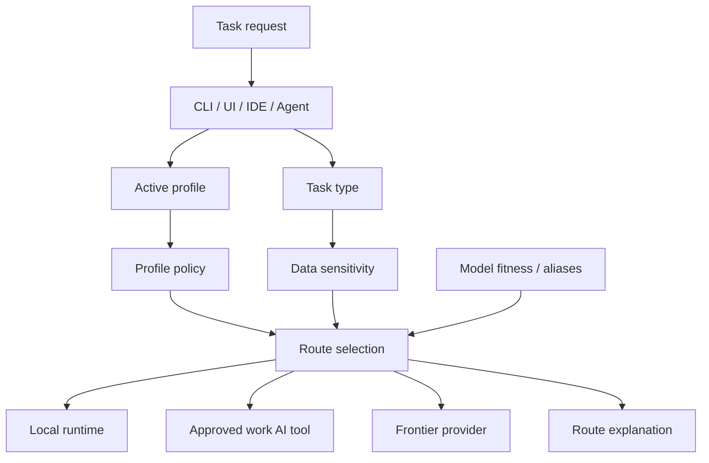
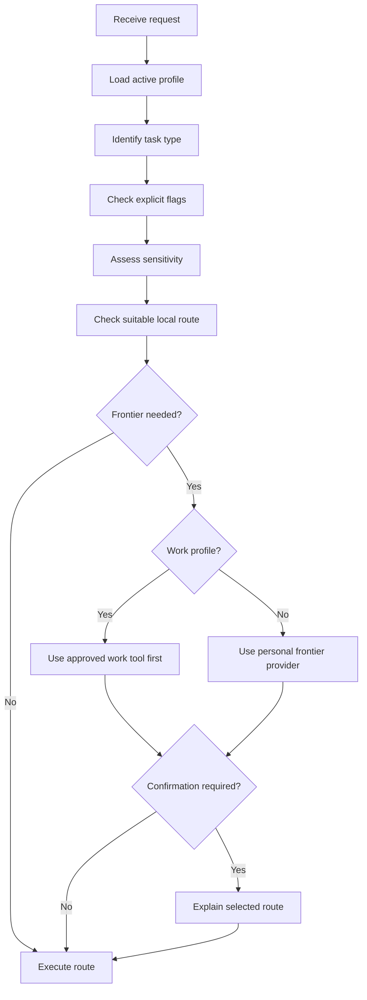
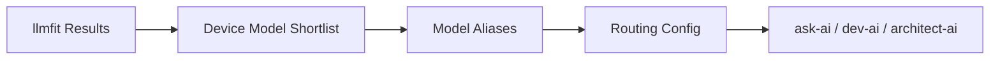

# Routing Strategy

## 1. Purpose

This document defines the routing strategy for **AI Dev Workstation as Code**.

Routing is how the workstation decides which model, runtime, provider or approved AI tool should handle a task.

I want routing to be:

- local-first
- profile-aware
- explainable
- configuration-driven
- secure
- easy to override
- simple enough to use every day

The aim is not to build a complex routing engine from day one. The aim is to create a practical routing model that can start simple and become smarter over time.

---

## 2. Routing principles

| Principle | Meaning |
|---|---|
| Local-first | Use local models where they are good enough for the task. |
| Profile-aware | Routing must behave differently for work and personal profiles. |
| Approved-tool aware | The work profile should prioritise approved tools first. |
| Deliberate escalation | Frontier escalation should happen for a reason, not by accident. |
| Explainable by default | I should be able to see why a route was selected. |
| Config over code | Routes, aliases and provider priorities should be defined in config. |
| Model fitness informed | Routing should be informed by what each device can actually run well. |
| Safe override | I should be able to explicitly request local-only or best-available behaviour. |
| Replaceable implementation | The routing mechanism can change without changing daily workflows. |

---

## 3. Routing architecture



The routing layer should sit between the user-facing workflow and the model provider.

The workflow should not need to know whether the selected route is Ollama, oMLX, Gemini, Cursor, OpenAI, Anthropic or a future provider.

---

## 4. Routing decision flow



Initial routing can be simple rule-based routing. The important thing is that the route is visible and governed by profile.

---

## 5. Routing tiers

The workstation should use a small number of routing tiers.

| Tier | Description | Typical use |
|---|---|---|
| `local_fast` | Fast local model for simple tasks | quick questions, summaries, rewrites |
| `local_capable` | Stronger local model for heavier tasks | explanation, structured drafting, coding help |
| `local_code` | Local model suited to coding | code explanation, small edits, learning |
| `approved_work` | Approved work AI tools | work profile tasks needing more capability |
| `frontier_reasoning` | Strong frontier reasoning model | complex reasoning, architecture review |
| `frontier_code` | Strong frontier coding model | difficult coding, repo-aware work |
| `frontier_writing` | Strong writing/synthesis model | high-quality drafting, synthesis |
| `manual` | User selects provider/model explicitly | testing, troubleshooting, comparison |

These tiers should map to actual models through profile-specific configuration.

---

## 6. Profile-specific provider posture

Routing must reflect the active profile.

### `macos-work`

The work profile should be conservative and approved-tool aware.

| Route type | Preferred posture |
|---|---|
| Default | Local-first |
| Approved tools | Gemini and Cursor first |
| Anthropic/OpenAI | Use-case dependent |
| Frontier escalation | Deliberate and explainable |
| Confirmation | Required where data sensitivity or policy warrants it |
| Agents | Disabled or restricted initially |

Example:

```text id="05o9sl"
macos-work:
  local first
  Gemini/Cursor first for approved work AI
  Anthropic/OpenAI only by use case and approval context
```

### `windows-personal`

The personal profile can be more experimental and frontier-friendly.

| Route type | Preferred posture |
|---|---|
| Default | Local-first |
| Primary frontier | OpenAI and Anthropic |
| Gemini | Optional / where useful |
| Frontier escalation | Allowed for coding, reasoning and experimentation |
| Confirmation | Not required by default |
| Agents | Candidate for future experimentation |

Example:

```text id="4w705a"
windows-personal:
  local first
  OpenAI/Anthropic first for frontier escalation
  Gemini optional where useful
```

### `fedora-atomic`

The future atomic profile should focus on rebuildability.

| Route type | Preferred posture |
|---|---|
| Default | Local-first |
| Providers | TBD |
| Services | Podman-first |
| Confirmation | Required until policy is clear |
| Agents | Future |
| RAG | Future |

---

## 7. Task types

Routing should eventually consider task type.

Initial task types:

| Task type | Description | Likely route |
|---|---|---|
| `quick_question` | Simple explanation or Q&A | `local_fast` |
| `summarise` | Summarise text or notes | `local_fast` or `local_capable` |
| `rewrite` | Rewrite or improve tone | `local_fast` or `local_capable` |
| `coding_explain` | Explain code or errors | `local_code` or `local_capable` |
| `coding_generate` | Generate code or scripts | `local_code` or `frontier_code` |
| `coding_debug` | Debug difficult issues | `local_code` then `frontier_code` |
| `architecture_review` | Review design or decision | `local_capable` or `frontier_reasoning` |
| `writing_polish` | Improve important writing | `local_capable` or `frontier_writing` |
| `research_synthesis` | Compare and synthesise information | `frontier_reasoning` where justified |
| `model_selection` | Choose or compare models | `local_capable` plus llmfit results |
| `agent_workflow` | Multi-step delegated task | future profile-controlled route |

The first implementation does not need perfect task classification. It can start with command-level defaults and explicit flags.

---

## 8. Data sensitivity

Routing should consider data sensitivity, especially for the work profile.

| Sensitivity | Meaning | Routing posture |
|---|---|---|
| `public` | Public or non-sensitive information | Local or frontier allowed by profile |
| `internal` | Internal but low-risk information | Local preferred; approved tools if needed |
| `customer` | Customer-specific or commercially sensitive | Work profile policy applies; approved tools first |
| `personal` | Personal information | Personal profile only unless intentionally shared |
| `restricted` | Highly sensitive or not suitable for external AI | Local-only or no AI route |

Initial routing can rely on manual user judgement. Later, commands may support explicit flags.

Examples:

```bash id="myvjo4"
ask-ai --sensitivity public "Explain this concept"
ask-ai --sensitivity internal "Summarise these work notes"
ask-ai --local --sensitivity restricted "Help me restructure this note"
```

---

## 9. User controls

I want routing to be useful but not invisible.

The CLI should support explicit controls.

| Flag | Meaning |
|---|---|
| `--local` | Force local-only route. |
| `--best` | Use the best available route for the task and profile. |
| `--explain-route` | Show why the route was selected. |
| `--profile` | Use a specific profile. |
| `--provider` | Manually select a provider where supported. |
| `--model` | Manually select a model where supported. |
| `--sensitivity` | Declare sensitivity level. |
| `--no-frontier` | Prevent frontier escalation. |
| `--confirm-frontier` | Require confirmation before frontier use. |

Examples:

```bash id="wlpap2"
ask-ai --local "Summarise this"
ask-ai --best --explain-route "Review this architecture option"
ask-ai --profile macos-work --sensitivity customer "Help me frame these talking points"
ask-ai --profile windows-personal --provider openai "Help debug this script"
```

---

## 10. Model aliases

Daily workflows should use aliases rather than hard-coded model names.

Aliases allow the implementation to change without changing the workflow.

Example alias model:

```yaml id="98as2k"
aliases:
  local_fast:
    description: Fast local model for simple tasks
    macos-work:
      provider: omlx
      model: tbd
    windows-personal:
      provider: ollama
      model: tbd

  local_capable:
    description: Stronger local model for explanation, drafting and reasoning
    macos-work:
      provider: omlx
      model: tbd
    windows-personal:
      provider: ollama
      model: tbd

  local_code:
    description: Local coding model
    macos-work:
      provider: ollama
      model: tbd
    windows-personal:
      provider: ollama
      model: tbd

  approved_work:
    description: Approved work AI route
    macos-work:
      providers:
        - gemini
        - cursor

  frontier_reasoning:
    description: High-quality reasoning route
    macos-work:
      providers:
        - gemini
        - anthropic
        - openai
      policy: use_case_dependent
    windows-personal:
      providers:
        - openai
        - anthropic

  frontier_code:
    description: High-quality coding route
    macos-work:
      providers:
        - cursor
        - gemini
        - anthropic
        - openai
      policy: approved_first
    windows-personal:
      providers:
        - anthropic
        - openai
```

This is illustrative only. Actual model names should be selected during implementation and informed by llmfit or equivalent model fitness results.

---

## 11. Route configuration

Initial routing should be configuration-led.

Possible structure:

```text id="0edvot"
config/
├── providers.yaml
├── models.yaml
├── routes.yaml
├── policies.yaml
└── capabilities.yaml
```

Example route configuration:

```yaml id="zjbyti"
routes:
  quick_question:
    default: local_fast
    allow_frontier: false

  summarise:
    default: local_fast
    fallback: local_capable
    allow_frontier: true

  architecture_review:
    default: local_capable
    fallback: frontier_reasoning
    allow_frontier: true
    explain: true

  coding_debug:
    default: local_code
    fallback: frontier_code
    allow_frontier: true
    explain: true
```

Example policy overlay:

```yaml id="g805s9"
profiles:
  macos-work:
    provider_priority:
      approved_work:
        - gemini
        - cursor
      frontier_reasoning:
        - gemini
        - anthropic
        - openai
    require_confirmation_for:
      - customer
      - restricted
    blocked_routes:
      restricted:
        - frontier_reasoning
        - frontier_code

  windows-personal:
    provider_priority:
      frontier_reasoning:
        - openai
        - anthropic
      frontier_code:
        - anthropic
        - openai
    require_confirmation_for: []
```

---

## 12. Explainable routing

Routing should be able to explain its decision in plain language.

Example:

```text id="44f7p2"
Route selected: local_capable
Profile: macos-work
Task type: summarise
Sensitivity: internal
Provider: omlx
Model: tbd

Reason:
- macos-work defaults to local-first.
- summarise can usually be handled locally.
- sensitivity is internal, so local is preferred.
- no frontier escalation was requested.
```

Another example:

```text id="krh5c7"
Route selected: approved_work
Profile: macos-work
Task type: architecture_review
Sensitivity: customer
Provider priority: Gemini, then Cursor

Reason:
- work profile prioritises approved AI tools first.
- architecture_review may need higher-quality reasoning.
- customer sensitivity requires approved-tool posture.
- Anthropic/OpenAI are use-case dependent and not first route.
```

For personal use:

```text id="ccpv93"
Route selected: frontier_code
Profile: windows-personal
Task type: coding_debug
Provider priority: Anthropic, then OpenAI

Reason:
- windows-personal allows frontier escalation for coding tasks.
- coding_debug often benefits from stronger reasoning.
- no work-sensitive context is present.
```

---

## 13. Routing validation tests

Routing should be testable from the beginning.

The purpose of routing tests is to prove that the workstation is selecting the expected route for a given profile, task type, sensitivity level and user override.

These tests are not model quality tests. They are architecture behaviour tests.

They should answer questions such as:

- does `macos-work` prefer local models for simple work-safe tasks?
- does `macos-work` prioritise Gemini and Cursor for approved work AI routes?
- does `windows-personal` use OpenAI and Anthropic as primary frontier escalation paths?
- does `--local` prevent frontier escalation?
- does restricted sensitivity block external routing?
- does gateway failure trigger the expected degraded mode?
- does a blocked context fail clearly?

### Initial routing test catalogue

| Test ID | Profile | Scenario | Input conditions | Expected route behaviour |
|---|---|---|---|---|
| `route-001` | `macos-work` | Local summary | `task=summarise`, `sensitivity=internal` | Use `local_fast` or `local_capable`; no frontier escalation. |
| `route-002` | `macos-work` | Customer architecture review | `task=architecture_review`, `sensitivity=customer`, `--best` | Use `approved_work` first; Gemini/Cursor before Anthropic/OpenAI. |
| `route-003` | `macos-work` | Restricted work content | `sensitivity=restricted` | Use local-only route or block; no frontier provider. |
| `route-004` | `macos-work` | Explicit local request | `--local`, any supported task | Use local route only; no approved or frontier provider. |
| `route-005` | `macos-work` | Non-approved frontier request | `provider=openai`, `sensitivity=customer` | Require confirmation or block depending on policy. |
| `route-006` | `windows-personal` | Personal coding debug | `task=coding_debug`, `--best` | Use `local_code` if suitable; otherwise `frontier_code` using Anthropic/OpenAI priority. |
| `route-007` | `windows-personal` | Explicit OpenAI request | `provider=openai` | Use OpenAI if configured and secrets are available. |
| `route-008` | `windows-personal` | Block work context | request uses `work` context | Block context load and do not route. |
| `route-009` | any active profile | Gateway unavailable, local requested | `--local`, gateway down, local fallback configured | Use `degraded_local` mode. |
| `route-010` | any active profile | Gateway unavailable, no fallback | gateway down, no fallback configured | Use `degraded_manual` mode and show recovery steps. |

### Example route test command

The implementation may eventually support a command such as:

```bash id="mdn30q"
ai-route --test
```

or targeted tests such as:

```bash id="xnn4v2"
ai-route \
  --profile macos-work \
  --task architecture_review \
  --sensitivity customer \
  --best \
  --explain
```

Expected output should be plain enough to understand without reading the config files.

Example:

```text id="s03aal"
Test: route-002
Profile: macos-work
Task: architecture_review
Sensitivity: customer
Requested mode: best

Expected:
- route: approved_work
- provider priority: gemini, cursor
- non-approved frontier providers are not first route

Actual:
- route: approved_work
- provider: gemini
- mode: normal

Result: PASS
```

### Test data

Routing tests should use synthetic prompts only.

The tests should not contain:

- real work content
- customer information
- secrets
- personal sensitive information
- internal Red Hat material

The test prompt content should be minimal because the purpose is to validate routing behaviour, not output quality.

Example:

```text id="y45mfr"
"Summarise this synthetic internal note."
"Review this fictional architecture option."
"Debug this small example Python function."
```

### Validation scope

Routing validation should be included in:

| Command | Role |
|---|---|
| `ai-route --test` | Runs routing decision tests. |
| `ai-bootstrap-check` | Confirms basic route configuration is valid after rebuild. |
| `ai-status` | Shows current route configuration and any unresolved aliases. |

Routing tests should check decisions before model calls where possible. This avoids unnecessary cost and reduces the chance of sending test content externally.

Related ADR:

```text id="v5hs3g"
docs/adr/0013-routing-validation-and-observability.md
```

---

## 14. Routing decision logging

Routing decisions should be observable from the first implementation.

I do not need a full observability platform at this stage. A simple structured local log is enough.

The purpose of routing logs is to help me understand:

- which profile was active
- which route was selected
- whether the task stayed local
- whether frontier escalation occurred
- whether degraded mode was used
- whether the request succeeded or failed
- how long the route took
- whether routing behaviour is drifting over time

### Logging principles

| Principle | Meaning |
|---|---|
| Metadata only by default | Do not log prompt text by default. |
| Profile-aware | Logs should include the active profile. |
| Privacy-conscious | Work and personal logs should not be mixed if that creates risk. |
| Useful for debugging | Logs should show selected route, provider, model alias and mode. |
| Simple first | JSONL file logging is enough for early milestones. |
| Replaceable later | Logging can move to richer observability later if useful. |

### Initial log format

A routing log entry should look broadly like this:

```json id="ayw7gr"
{
  "timestamp": "2026-06-24T10:00:00+12:00",
  "profile": "macos-work",
  "command": "ask-ai",
  "task_type": "summarise",
  "sensitivity": "internal",
  "route": "local_fast",
  "provider": "omlx",
  "model_alias": "local_fast",
  "model": "tbd",
  "mode": "normal",
  "gateway_used": true,
  "degraded_mode": false,
  "frontier_used": false,
  "prompt_hash": "sha256:...",
  "latency_ms": 1234,
  "status": "success"
}
```

For a degraded route:

```json id="7xwnq7"
{
  "timestamp": "2026-06-24T10:05:00+12:00",
  "profile": "windows-personal",
  "command": "ask-ai",
  "task_type": "quick_question",
  "sensitivity": "personal",
  "route": "local_fast",
  "provider": "ollama",
  "model_alias": "local_fast",
  "mode": "degraded_local",
  "gateway_used": false,
  "degraded_mode": true,
  "frontier_used": false,
  "prompt_hash": "sha256:...",
  "latency_ms": 980,
  "status": "success"
}
```

For a blocked route:

```json id="bve9zl"
{
  "timestamp": "2026-06-24T10:10:00+12:00",
  "profile": "windows-personal",
  "command": "research-ai",
  "task_type": "research_synthesis",
  "sensitivity": "work",
  "route": "blocked",
  "provider": null,
  "model_alias": null,
  "mode": "policy_block",
  "gateway_used": false,
  "degraded_mode": false,
  "frontier_used": false,
  "reason": "work context is not available to windows-personal profile",
  "status": "blocked"
}
```

### Prompt handling

Prompt text should not be logged by default.

If a prompt identifier is needed, use a hash:

```text id="hwvu8k"
prompt_hash = sha256(prompt)
```

The purpose of the hash is only to correlate repeated routing events without storing the prompt itself.

For work profile usage, logging should be conservative. If there is any doubt, omit the hash as well.

### Log location

The log location should be configurable.

Possible early structure:

```text id="rhlyzv"
logs/
└── routing/
    ├── macos-work.jsonl
    └── windows-personal.jsonl
```

These logs should not be committed.

The `.gitignore` should exclude:

```text id="0c7g95"
logs/
```

A future implementation may choose an OS-appropriate application data directory instead. The important point is that routing logs are local, structured and excluded from git.

### Logging events

Routing logs should be written for:

| Event | Log? |
|---|---:|
| successful local route | Yes |
| successful approved work route | Yes |
| successful frontier route | Yes |
| degraded local fallback | Yes |
| degraded manual failure | Yes |
| blocked route | Yes |
| route test result | Optional |
| validation check | Optional |

### Relationship to model fitness

Routing logs may later help model fitness decisions.

For example, logs can show:

- local model routes that frequently fail
- tasks that often escalate to frontier providers
- latency differences between local models
- profile-specific usage patterns
- aliases that need review

This does not need to be automated in Milestone 1. The initial value is visibility and debugging.

### Relationship to LiteLLM callbacks

If the gateway supports useful callback or logging behaviour, I may use that later.

However, the first implementation should not depend on a full gateway logging setup. CLI-level logging is enough to start because it captures the decision before the request reaches the provider.

Related ADR:

```text id="uwbxlu"
docs/adr/0013-routing-validation-and-observability.md
```

---

## 15. Relationship to llmfit

Model fitness should inform routing over time.

llmfit or an equivalent process should help answer:

- which local models run well on each device
- which models are too slow
- which models are suitable for coding
- which models are suitable for summarisation
- which models are suitable for reasoning
- which models should back each alias



Routing should not be based only on model popularity. It should be based on actual device and task fit.

---

## 16. Gateway relationship

The gateway should execute the selected route where practical.

Routing may happen in one of two ways:

| Pattern | Description |
|---|---|
| External routing | A CLI wrapper selects the route, then calls the gateway with the selected provider/model. |
| Gateway routing | The gateway handles routing internally based on config or aliases. |

Initial implementation can use external routing because it is easier to understand and debug.

Over time, some routing may move into the gateway if that becomes cleaner.

The important principle is that the user-facing commands should remain stable.

---

## 17. Initial implementation scope

The first routing implementation should be deliberately simple.

Milestone 1 should include:

- active profile detection
- provider configuration placeholders
- model alias placeholders
- simple route config
- `ask-ai --local`
- `ask-ai --best`
- `ai-route`
- `--explain-route` behaviour
- local-first default
- basic profile-aware provider priority

Milestone 1 does not need:

- semantic routing
- automatic sensitivity detection
- advanced policy engine
- cost optimisation
- usage analytics
- autonomous model selection
- agent routing

Those can come later if they are genuinely useful.

---

## 18. Routing examples

### macOS work — local summary

```bash id="ba5mdq"
ask-ai --profile macos-work --sensitivity internal "Summarise this note"
```

Expected posture:

```text id="x08sjs"
local_first → local_fast or local_capable
```

### macOS work — customer architecture review

```bash id="k19ld1"
ask-ai --profile macos-work --best --sensitivity customer "Review this architecture option"
```

Expected posture:

```text id="1atdm5"
approved_work first → Gemini or Cursor
Anthropic/OpenAI only depending on use case and approval context
```

### Windows personal — coding debug

```bash id="jwq1dr"
ask-ai --profile windows-personal --best "Debug this Python script"
```

Expected posture:

```text id="u7w7kc"
local_code first if suitable
frontier_code using Anthropic/OpenAI if needed
```

### Windows personal — explicit OpenAI test

```bash id="wgo6gc"
ask-ai --profile windows-personal --provider openai "Compare these implementation options"
```

Expected posture:

```text id="i01l53"
manual provider selection
```

### Restricted local-only task

```bash id="0dgx86"
ask-ai --local --sensitivity restricted "Help me restructure this note"
```

Expected posture:

```text id="493y7r"
local-only
no frontier escalation
```

---

## 19. Risks and mitigations

| Risk | Mitigation |
|---|---|
| Routing becomes too complex too early | Start with simple config-led routing. |
| Work profile accidentally uses non-approved tools first | Encode approved-tool priority in `macos-work` policy. |
| User does not know where a request went | Add `--explain-route` and `ai-route`. |
| Local models underperform | Use frontier escalation and llmfit-informed aliases. |
| Provider config becomes scattered | Centralise providers, models, routes and policies in config. |
| Sensitive data is routed externally | Support sensitivity flags and conservative work profile defaults. |
| UI and CLI route differently | Route both through the same gateway and config where practical. |
| Model aliases drift from actual performance | Periodically review llmfit results and update aliases. |
| Routing behaviour drifts without being noticed | Add routing validation tests and expected route scenarios. |
| Work profile routes to non-approved providers first | Test approved-tool priority for `macos-work`. |
| Routing logs expose sensitive content | Log metadata only by default and exclude logs from git. |
| Gateway failure path is untested | Add gateway-down routing tests for degraded local and degraded manual modes. |

---

## 20. Future evolution

Routing can evolve over time.

Potential future improvements:

- semantic task classification
- automatic sensitivity hints
- cost-aware routing
- latency-aware routing
- model quality scoring
- per-command routing profiles
- agent-specific route policies
- project-specific routing rules
- RAG-aware routing
- route logging and usage review
- richer confirmation workflows for work profile

These should only be added when the simple routing model is no longer enough.

---

## 21. Summary

The routing strategy is:

```text id="qkg19w"
Local-first.
Profile-aware.
Approved-tool aware for work.
OpenAI/Anthropic-friendly for personal.
Explainable.
Config-driven.
Simple first.
Smarter later.
```

The first routing implementation should help me understand and control where AI tasks go.

It should not try to be clever before it is trustworthy.
