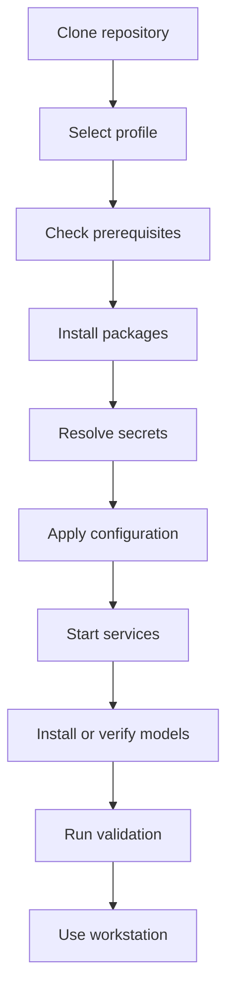
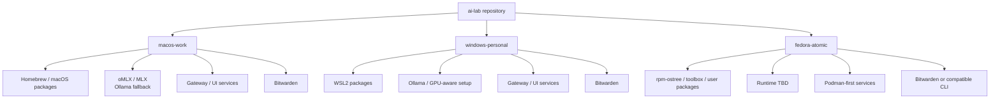
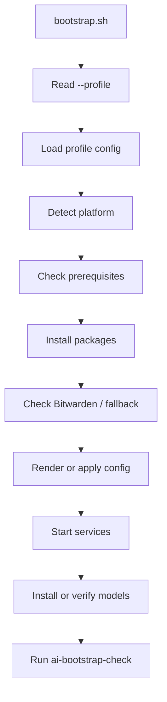
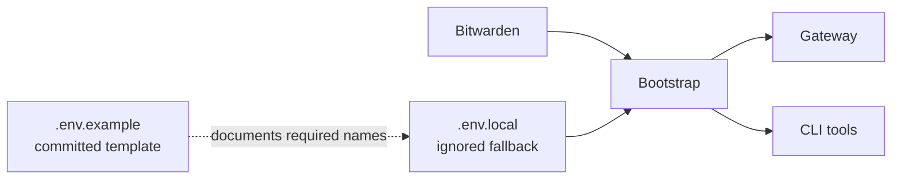

# Rebuild Strategy

## 1. Purpose

This document defines the rebuild strategy for **AI Dev Workstation as Code**.

I want this workstation to be recoverable from the repository, not dependent on undocumented local machine state. If I rebuild a laptop, move to a new device, or test a future atomic Linux environment, I should be able to recreate the workstation in a repeatable way.

The goal is:

```text
Clone the repo.
Select a profile.
Run bootstrap.
Validate the workstation.
Start using it.
```

This does not mean everything needs to be perfectly automated on day one. It means manual steps should be visible, documented and gradually reduced.

---

## 2. Rebuild principles

| Principle | Meaning |
|---|---|
| Repository as source of truth | Important setup should live in the repo, not only on the machine. |
| Profile-driven rebuilds | Bootstrap and validation should use the selected profile. |
| Thin host where practical | Keep host changes minimal and explicit. |
| Services as code | Gateway, UI and future services should be defined in repeatable config. |
| Secure secrets | Secrets should come from Bitwarden where practical, not committed files. |
| Idempotent scripts | Bootstrap should be safe to rerun where practical. |
| Validate after setup | A rebuild is not complete until health checks pass. |
| Manual steps are technical debt | If something cannot be automated yet, document it clearly. |
| Cross-platform by design | macOS, Windows/WSL2 and future Fedora Atomic should share patterns where possible. |

---

## 3. Target rebuild flow



The target command flow should eventually look like this:

```bash
git clone https://github.com/Deim0s13/ai-lab.git
cd ai-lab
./bootstrap/bootstrap.sh --profile macos-work
ai-bootstrap-check
ai-status
```

For Windows, the equivalent may run from WSL2:

```bash
git clone https://github.com/Deim0s13/ai-lab.git
cd ai-lab
./bootstrap/bootstrap.sh --profile windows-personal
ai-bootstrap-check
ai-status
```

---

## 4. Rebuild scope

The rebuild strategy covers:

| Area | Rebuild approach |
|---|---|
| Packages | Declared in profile-aware package files. |
| CLI tools | Installed or linked through bootstrap. |
| Gateway | Defined through config and container/service files. |
| Chat UI | Containerised where practical. |
| Local runtimes | Installed through documented/profile-specific steps. |
| Models | Declared as desired models or aliases; model binaries are not stored in git. |
| Providers | Defined in config; secrets resolved separately. |
| Secrets | Bitwarden preferred, `.env.local` fallback only. |
| Profiles | Stored under `profiles/`. |
| Routing | Stored under `config/`. |
| Contexts | Stored or referenced under `contexts/`, with profile boundaries. |
| Validation | Implemented through `ai-bootstrap-check` and `ai-status`. |
| Documentation | Stored under `docs/`. |

The rebuild strategy does not mean the repo stores everything. It means the repo defines how to recreate everything.

---

## 5. Platform rebuild model



Each platform can have different installation mechanics, but the architecture should remain consistent.

---

## 6. macOS rebuild strategy

The `macos-work` profile should support the MacBook Pro work device.

### Expected rebuild responsibilities

| Area | Approach |
|---|---|
| Package management | Homebrew where appropriate. |
| Local runtime | oMLX / MLX-compatible runtime preferred. |
| Fallback runtime | Ollama. |
| Gateway | Local service or container where practical. |
| Chat UI | Containerised Open WebUI later. |
| Secrets | Bitwarden preferred. |
| Frontier / approved tools | Gemini and Cursor first; Anthropic/OpenAI use-case dependent. |
| Validation | Confirm runtime, gateway, secrets and approved-tool posture. |

### Design notes

The macOS work rebuild should be conservative. It should not assume every experimental component is installed. It should focus on work-safe capability first:

- local model access
- approved-tool-first posture
- CLI general assistant
- routing explanation
- validation
- model fitness

Experimental agents and personal project tooling should not be enabled by default.

---

## 7. Windows rebuild strategy

The `windows-personal` profile should support the Windows personal AI development lab.

### Expected rebuild responsibilities

| Area | Approach |
|---|---|
| Base environment | Windows with WSL2. |
| Package management | WSL2 package manager and optional Windows package tooling where useful. |
| Local runtime | Ollama primary. |
| GPU support | Use local GPU where available. |
| Gateway | Local service or container. |
| Chat UI | Containerised Open WebUI later. |
| Secrets | Bitwarden preferred. |
| Frontier providers | OpenAI and Anthropic first; Gemini where useful. |
| Validation | Confirm WSL2, Ollama, GPU where applicable, gateway, secrets and CLI tools. |

### Design notes

The Windows profile can be more experimental because it is the personal development lab.

This is the right place to trial:

- coding assistants
- OpenAI and Anthropic frontier routing
- agent runners
- local model comparisons
- routing experiments
- RAG/project memory later

Even though it is more experimental, components should still move through the lifecycle rather than becoming permanent by accident.

---

## 8. Fedora Atomic rebuild strategy

The `fedora-atomic` profile is a future target.

It exists to keep the architecture honest about rebuildability, even if it is not implemented immediately.

### Expected rebuild responsibilities

| Area | Approach |
|---|---|
| Host model | Thin host. |
| System packages | Minimal host mutation. |
| Services | Podman-first. |
| Dev tools | User-space, toolbox, distrobox or equivalent. |
| Local runtime | TBD. |
| Secrets | Bitwarden or Linux-compatible equivalent. |
| Validation | Confirm profile, services, runtime and CLI tools. |

### Design notes

This profile should help test whether the workstation can work in a more disposable machine model.

The design should avoid relying on hidden host state, manual service setup or untracked configuration.

---

## 9. Repository structure for rebuildability

Target structure:

```text
ai-lab/
├── bootstrap/
├── profiles/
├── packages/
├── containers/
├── config/
├── contexts/
├── dotfiles/
├── tools/
├── tests/
├── docs/
└── archive/
```

### Directory responsibilities

| Directory | Rebuild responsibility |
|---|---|
| `bootstrap/` | Entry point scripts for setup and rebuild. |
| `profiles/` | Device/profile definitions. |
| `packages/` | Package lists by OS/profile. |
| `containers/` | Gateway, Open WebUI and future service definitions. |
| `config/` | Providers, models, routes, policies and capabilities. |
| `contexts/` | Work, personal, shared and project context definitions. |
| `dotfiles/` | Optional shell/editor configuration if needed. |
| `tools/` | CLI commands and wrappers. |
| `tests/` | Validation and health checks. |
| `docs/` | Architecture and decisions. |
| `archive/` | Historical material and retired experiments. |

The structure should support rebuildability without becoming overly complicated.

---

## 10. Bootstrap architecture

The bootstrap process should be profile-aware.



Bootstrap should eventually support:

```bash
./bootstrap/bootstrap.sh --profile macos-work
./bootstrap/bootstrap.sh --profile windows-personal
./bootstrap/bootstrap.sh --profile fedora-atomic
```

The first implementation can be basic. It should focus on making the expected steps explicit.

---

## 11. Bootstrap behaviour

Bootstrap scripts should aim to be:

| Behaviour | Meaning |
|---|---|
| Idempotent | Safe to rerun without breaking the environment. |
| Profile-aware | Install only what the selected profile needs. |
| Transparent | Show what is being checked, installed or skipped. |
| Conservative | Avoid destructive changes unless explicitly requested. |
| Validated | Run or suggest validation after setup. |
| Modular | Split platform-specific logic into separate scripts where useful. |

Possible structure:

```text
bootstrap/
├── bootstrap.sh
├── lib/
│   ├── detect-platform.sh
│   ├── load-profile.sh
│   ├── check-prereqs.sh
│   ├── install-packages.sh
│   ├── configure-secrets.sh
│   ├── configure-services.sh
│   └── validate.sh
├── macos/
├── windows/
└── fedora/
```

This structure is illustrative. The implementation can start simpler and evolve.

---

## 12. Package strategy

Package installation should be declared rather than remembered.

Possible package files:

```text
packages/
├── macos-work.brew
├── windows-personal.apt
├── fedora-atomic.packages
└── shared.tools
```

Examples:

| Profile | Package approach |
|---|---|
| `macos-work` | Homebrew packages, Python tooling, Node tooling if needed. |
| `windows-personal` | WSL2 Linux packages, Python tooling, optional Windows tooling. |
| `fedora-atomic` | Minimal host packages, user-space tools, containers. |

The exact package strategy can evolve. The principle is that required packages should be declared somewhere in the repo.

---

## 13. Container and service strategy

Services should be containerised where practical.

Good candidates for containers:

| Service | Notes |
|---|---|
| Model gateway | LiteLLM or equivalent. |
| Chat UI | Open WebUI. |
| Vector database | Future RAG/project memory. |
| Observability | Future, only if useful. |

Not everything needs to be containerised.

Host or user-space tools may still be better for:

- Ollama
- oMLX / MLX runtime
- Bitwarden CLI
- llmfit
- Aider / OpenCode
- Goose
- small CLI wrappers

Containerisation should reduce rebuild friction, not add unnecessary complexity.

---

## 14. Secrets strategy

Secrets must not be committed.

The preferred approach is Bitwarden.



### Intended pattern

```text
Bitwarden
= preferred source for secrets

.env.example
= committed template showing required variable names

.env.local
= ignored local fallback only
```

Expected secrets may include:

```text
ANTHROPIC_API_KEY=
OPENAI_API_KEY=
GEMINI_API_KEY=
```

The project should avoid storing secrets in:

- committed files
- shell profiles
- bootstrap scripts
- container compose files
- routing configuration
- model configuration

A future `ai-secrets` helper may be useful so Bitwarden integration is centralised rather than scattered across scripts.

---

## 15. Model rebuild strategy

Model binaries should not be stored in git.

Instead, the repo should define:

- desired models
- model aliases
- runtime/provider mapping
- profile-specific model shortlists
- model fitness results or references

Example:

```yaml
models:
  macos-work:
    local_fast:
      provider: omlx
      model: tbd
    local_capable:
      provider: omlx
      model: tbd
    local_code:
      provider: ollama
      model: tbd

  windows-personal:
    local_fast:
      provider: ollama
      model: tbd
    local_capable:
      provider: ollama
      model: tbd
    local_code:
      provider: ollama
      model: tbd
```

Model installation can be automated later. Initially, validation can simply report whether required or preferred models are available.

---

## 16. Config rebuild strategy

Configuration should be stored in the repo where safe.

Potential config files:

```text
config/
├── providers.yaml
├── models.yaml
├── routes.yaml
├── policies.yaml
├── capabilities.yaml
└── gateway/
```

Config should define:

- providers
- provider priority
- model aliases
- task routes
- profile policy overlays
- capability flags
- fallback behaviour
- validation expectations

Secrets should be referenced by name only. Values should come from Bitwarden or ignored local fallback.

---

## 17. Validation strategy

A rebuild is not complete until validation passes.

Validation should be split into two main commands:

| Command | Purpose |
|---|---|
| `ai-bootstrap-check` | Confirms the workstation was set up correctly after bootstrap. |
| `ai-status` | Shows current health and active profile status during normal use. |

Validation should check:

| Check | Purpose |
|---|---|
| Active profile | Confirms the selected profile is known. |
| Platform | Confirms expected OS/subsystem. |
| Packages | Confirms required tools exist. |
| Secrets | Confirms required secrets are available without exposing them. |
| Gateway | Confirms gateway is running or reachable. |
| Local runtime | Confirms Ollama, oMLX or relevant runtime is available. |
| Models | Confirms expected models or aliases are available. |
| Providers | Confirms configured providers are available where appropriate. |
| CLI commands | Confirms commands such as `ask-ai` and `ai-route` work. |
| Services | Confirms containers or local services are healthy. |

Example output:

```text
Profile: macos-work
Platform: macOS
Secrets: Bitwarden available
Gateway: running
Local runtime: oMLX available, Ollama fallback available
Approved tools: Gemini configured, Cursor available
Frontier providers: Anthropic optional, OpenAI optional
Models: local_fast unresolved
Status: WARN
Next action: run ai-model-review or configure local_fast alias
```

Validation should explain what is wrong and what to do next.

---

## 18. Manual steps strategy

Manual steps are allowed early, but they should be visible.

For each manual step, document:

| Field | Description |
|---|---|
| Step | What must be done manually. |
| Profile | Which profile it applies to. |
| Reason | Why it is manual for now. |
| Future automation | How it could be automated later. |
| Validation | How to confirm it was done. |

Example:

```markdown
| Step | Profile | Reason | Future automation | Validation |
|---|---|---|---|---|
| Install Cursor | macos-work | Work-approved tool installed outside repo | Document install/check only | `ai-status` detects Cursor |
```

Manual does not mean bad. Undocumented manual state is the problem.

---

## 19. Definition of done for rebuildability

A profile is considered rebuildable when:

| Requirement | Done? |
|---|---:|
| Profile config exists | Yes |
| Required packages are declared | Yes |
| Bootstrap can run without destructive side effects | Yes |
| Secrets approach is documented | Yes |
| Gateway can be started or checked | Yes |
| Local runtime can be installed or checked | Yes |
| Model aliases are defined | Yes |
| Validation command exists | Yes |
| Known manual steps are documented | Yes |
| README/docs explain how to rebuild | Yes |

For Milestone 1, “rebuildable” can mean:

```text
Enough is automated or documented that I can recreate the gateway foundation on a fresh or reset environment.
```

It does not need to mean perfect one-command automation yet.

---

## 20. Risks and mitigations

| Risk | Mitigation |
|---|---|
| Bootstrap becomes too complex | Start simple and modularise only when needed. |
| Manual setup remains hidden | Document manual steps as technical debt. |
| Secrets leak into config | Use Bitwarden, `.env.example` and ignored fallback only. |
| Work and personal profiles drift | Make validation profile-aware. |
| Models are too large or slow | Use llmfit and model aliases. |
| Containers add unnecessary complexity | Containerise services, not every tool. |
| Cross-platform support becomes messy | Keep shared contracts, profile-specific implementation. |
| Rebuild is never tested | Run validation after each milestone and profile change. |

---

## 21. Initial implementation scope

Milestone 1 should focus on a rebuildable gateway foundation.

Expected initial deliverables:

- `profiles/macos-work/profile.yaml`
- `profiles/windows-personal/profile.yaml`
- `.env.example`
- Bitwarden-oriented secrets notes
- basic provider config
- basic model alias config
- basic route config
- gateway service definition
- basic `ask-ai`
- basic `ai-route`
- basic `ai-status`
- basic `ai-bootstrap-check`
- documented manual steps

Not included in Milestone 1:

- full semantic routing
- complete model installation automation
- fully automated Cursor/Gemini integration
- agent workflows
- RAG/project memory
- advanced observability
- production-style secrets platform

---

## 22. Summary

The rebuild strategy is:

```text
Repository as source of truth.
Profiles drive setup.
Bitwarden protects secrets.
Services are defined as code.
Models are declared, not committed.
Validation proves the rebuild.
Manual steps are documented until automated.
```

The machine should be replaceable.

The workstation should be recoverable.
