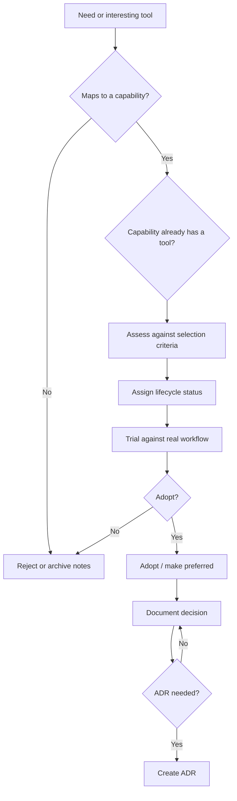

# Tool Selection

## 1. Purpose

This document defines how I select tools for **AI Dev Workstation as Code**.

The workstation should be open-source-first, but not tool-first. I do not want to keep adding interesting tools just because they exist. Every tool should have a clear role, map to a capability, fit the architecture principles, and support a real workflow.

The goal is:

```text
Adopt useful tools deliberately.
Avoid tool sprawl.
Keep components replaceable.
```

---

## 2. Tool selection principles

| Principle | Meaning |
|---|---|
| Capability before tool | A tool should satisfy a defined capability. |
| Open-source-first | Active open-source tools should be considered before custom development. |
| CLI-compatible | Tools should support CLI workflows where practical. |
| Gateway-compatible | Tools should work with the gateway model where practical. |
| Profile-aware | Tool usage must make sense for `macos-work`, `windows-personal` or future profiles. |
| Rebuildable | Tools should be installable and configurable from the repo where practical. |
| Secure by default | Tools must not require unsafe secrets handling or unclear data exposure. |
| Replaceable | A better tool should be able to replace it without redesigning the workstation. |
| Daily-use justified | Tools should support a real recurring workflow. |

---

## 3. Tool selection flow



A tool should not move straight from “interesting” to “standard build”.

---

## 4. Standard selection questions

Before adopting a tool, I should be able to answer these questions.

| Question | Why it matters |
|---|---|
| What capability does this tool satisfy? | Prevents tool-first decisions. |
| What workflow does it support? | Keeps the project focused on daily use. |
| Which profile will use it? | Ensures work and personal usage stay separate. |
| Is it open-source or open enough for this project? | Supports the open-source-first principle. |
| Is it actively maintained? | Reduces risk of adopting abandoned tooling. |
| Does it support CLI usage? | Keeps the workstation CLI-native. |
| Does it work with the gateway? | Avoids separate AI environments. |
| Does it support local models? | Supports local-first usage. |
| Does it support frontier or approved providers where needed? | Supports escalation when justified. |
| Can it be installed repeatably? | Supports rebuildability. |
| Can it be configured from the repo? | Avoids undocumented machine state. |
| Does it need secrets? | Triggers secure secrets handling. |
| Does it respect profile boundaries? | Prevents work/personal drift. |
| Can it be validated? | Supports health checks and rebuild confidence. |
| Can it be removed cleanly? | Keeps the system replaceable. |

---

## 5. Selection criteria

Tools should be assessed across these dimensions.

| Dimension | What I am looking for |
|---|---|
| Capability fit | The tool clearly implements a needed capability. |
| Architecture fit | It aligns with gateway-first, CLI-native and rebuildable principles. |
| Profile fit | It works appropriately for the intended profile. |
| Workflow value | It supports something I will actually use. |
| Local model support | It can use local models directly or through the gateway where relevant. |
| Frontier support | It can use frontier or approved AI tools where appropriate. |
| Gateway support | It can integrate with LiteLLM or equivalent where practical. |
| CLI support | It can be operated from the terminal or supports CLI-friendly workflows. |
| Configuration model | It can be configured in a way that is trackable and repeatable. |
| Secrets handling | It can use Bitwarden or safe local fallback patterns. |
| Maintenance | It has active development, documentation and a healthy community. |
| Operational complexity | It does not add more overhead than the value it provides. |
| Replacement path | It can be swapped out later if a better option appears. |

---

## 6. Fit assessment

A simple fit rating is enough.

| Rating | Meaning |
|---|---|
| Strong fit | Clearly supports the capability and aligns with the architecture. |
| Good fit | Useful, with manageable trade-offs. |
| Trial fit | Worth testing, but not proven yet. |
| Weak fit | Has issues that may outweigh the benefit. |
| Reject | Does not fit the capability, architecture or profile posture. |

Example:

```yaml
tool: Open WebUI
capability: Chat UI
fit: Trial fit
reason:
  - Strong local AI UI candidate
  - Needs gateway compatibility check
  - Persistence and profile behaviour need review
status: Candidate / Trial
```

---

## 7. Open-source-first does not mean open-source-only

This project should prefer open-source tools where practical.

However, the workstation also needs to support approved work AI tools and frontier providers.

That means:

| Area | Posture |
|---|---|
| Gateway | Open-source-first |
| Local runtimes | Open-source-first |
| Chat UI | Open-source-first |
| Coding assistants | Open-source-first where useful, but existing approved/commercial tools may remain part of the wider workflow |
| Secrets | Bitwarden preferred |
| Work AI tools | Approved-tool-first for `macos-work` |
| Frontier models | Profile-aware and use-case dependent |

For `macos-work`, Gemini and Cursor should be documented as the first-use AI tools because they are the current approved work tools.

For `windows-personal`, OpenAI and Anthropic can be primary frontier escalation paths because that profile is for personal development and experimentation.

---

## 8. Build versus adopt

I should build custom functionality only when it adds a project-specific layer that existing tools do not provide.

### Prefer adoption for

| Capability | Prefer existing tools |
|---|---|
| Model gateway | LiteLLM or equivalent |
| Local runtime | Ollama, oMLX / MLX-compatible runtime |
| Chat UI | Open WebUI or equivalent |
| Coding assistant | Aider, OpenCode or equivalent |
| Agent runner | Goose or equivalent |
| Model fitness | llmfit or equivalent |
| Secrets | Bitwarden CLI / Secrets Manager CLI |

### Prefer custom thin wrappers for

| Workflow | Reason |
|---|---|
| `ask-ai` | Stable daily-use CLI entry point. |
| `ai-route` | Explain routing decisions in my terms. |
| `ai-status` | Profile-aware workstation health. |
| `ai-bootstrap-check` | Rebuild validation. |
| `ai-model-review` | Capture and apply model fitness results. |
| `architect-ai` | Project-specific architecture assistant workflow. |
| `write-ai` | Project-specific writing/tone workflow. |
| `research-ai` | Project-specific research workflow. |
| `ai-secrets` | Centralise Bitwarden secret retrieval if needed. |

The custom layer should stay thin. It should hide complexity, not create a private platform.

---

## 9. Tool selection by capability

### 9.1 Model Gateway

| Field | Selection posture |
|---|---|
| Capability | Model Gateway |
| Current candidate | LiteLLM or equivalent |
| Why considered | Multi-provider gateway, OpenAI-compatible access pattern, useful for routing local and frontier models. |
| Must support | Local runtimes, frontier providers, model aliases, config-driven use, CLI and UI access. |
| Key tests | Can `ask-ai` and Open WebUI both use it? Can it support macOS and Windows profile policies? |
| Risks | Configuration complexity, another moving part, provider compatibility drift. |
| Initial status | Candidate / Trial |

---

### 9.2 Windows Local Runtime

| Field | Selection posture |
|---|---|
| Capability | Local Runtime — Windows |
| Current implementation | Ollama |
| Why selected | Practical local model runtime with broad model availability and good fit for personal experimentation. |
| Must support | WSL2 use, local model management, API access, gateway integration, GPU use where available. |
| Key tests | Can it run useful coding and reasoning models? Can the gateway reach it? Can `ai-status` validate it? |
| Risks | GPU configuration, model performance variability, model storage size. |
| Initial status | Adopted |

---

### 9.3 macOS Local Runtime

| Field | Selection posture |
|---|---|
| Capability | Local Runtime — macOS |
| Current candidates | oMLX / MLX-compatible runtime, Ollama fallback |
| Why considered | I want an Apple Silicon-friendly runtime for the work profile, with Ollama available for compatibility. |
| Must support | Local model execution, CLI usability, gateway integration, repeatable setup and work-safe local usage. |
| Key tests | Does it run well on the MBP? Can it support useful local models? Can it integrate with the gateway? |
| Risks | Model availability, API compatibility, tool support, runtime maturity. |
| Initial status | Candidate |

---

### 9.4 Frontier / Approved AI Tools

| Field | Selection posture |
|---|---|
| Capability | Frontier / Approved Providers |
| Current candidates | Gemini, Cursor, OpenAI, Anthropic |
| Why considered | Local models will not handle every task; frontier and approved tools remain important. |
| Must support | Profile-aware escalation, secure secrets, clear approval posture and routing integration where practical. |
| Work profile posture | Gemini and Cursor first; Anthropic and OpenAI depending on use case, data sensitivity and approval context. |
| Personal profile posture | OpenAI and Anthropic first; Gemini where useful. |
| Risks | Approval changes, data sensitivity, cost, provider policy changes. |
| Initial status | Candidate |

---

### 9.5 Chat UI

| Field | Selection posture |
|---|---|
| Capability | Chat UI |
| Current candidate | Open WebUI |
| Why considered | Provides a self-hosted UI for local and routed model access. |
| Must support | Gateway integration, local model access, frontier model access where appropriate, repeatable setup and clear persistence model. |
| Key tests | Can it use the same gateway as the CLI? Does it avoid becoming a separate AI environment? Can it be containerised cleanly? |
| Risks | Data persistence, profile drift, operational overhead. |
| Initial status | Candidate / Trial |

---

### 9.6 CLI Coding Assistant

| Field | Selection posture |
|---|---|
| Capability | CLI Coding Assistant |
| Current candidates | Aider, OpenCode |
| Why considered | Support terminal-native coding, local-first coding and personal vibe coding workflows. |
| Must support | Repo-aware coding, safe file modification, local/frontier model usage, CLI ergonomics and repeatable install. |
| Key tests | Does it fit my Claude Code-style habits? Can it use local/routed models? Is file modification transparent and safe? |
| Risks | Workflow mismatch, unsafe edits, weak local model support, provider lock-in. |
| Initial status | Candidate |

---

### 9.7 Agent Runner

| Field | Selection posture |
|---|---|
| Capability | Agent Runner |
| Current candidate | Goose or equivalent |
| Why considered | Potential future support for constrained multi-step workflows. |
| Must support | CLI usage, explicit permissions, local/frontier provider options, observable execution and profile-aware controls. |
| Key tests | Can it run constrained workflows safely? Can work and personal profiles apply different permissions? |
| Risks | Too much autonomy too early, unclear file permissions, poor observability, unnecessary complexity. |
| Initial status | Future candidate |

---

### 9.8 Model Fitness

| Field | Selection posture |
|---|---|
| Capability | Model Fitness |
| Current candidate | llmfit |
| Why considered | Model selection should be informed by device and task fit, not hype. |
| Must support | Device-aware model assessment, repeatable results, useful output for model aliases and routing. |
| Key tests | Does it give useful guidance for both MBP and Windows devices? Can results inform `local_fast`, `local_capable` and `local_code` aliases? |
| Risks | Output may be too generic, limited runtime support, manual interpretation required. |
| Initial status | Candidate / Planned |

---

### 9.9 Secrets Management

| Field | Selection posture |
|---|---|
| Capability | Secrets Management |
| Current candidate | Bitwarden |
| Why selected | I already use Bitwarden. It fits the project better than introducing a heavier secrets platform. |
| Must support | Secure storage, CLI retrieval where practical, cross-platform use, rebuild-friendly setup and validation without exposing values. |
| Key tests | Can bootstrap and validation check required secrets? Is the CLI workflow practical? Is Secrets Manager a better fit than general vault CLI? |
| Risks | CLI session handling, local developer ergonomics, separating work and personal secrets. |
| Initial status | Preferred direction |

---

## 10. Tool trial record

When trialling a tool, I should capture a short record.

Suggested format:

```yaml
tool: Aider
capability: CLI Coding Assistant
status: Trial
profile:
  - windows-personal
trial_workflow:
  - Use against a small repo
  - Test local model route
  - Test frontier route
  - Review file edit safety
success_criteria:
  - Fits CLI workflow
  - Safe and understandable edits
  - Works with routed models where practical
  - Easy to install and remove
risks:
  - Provider lock-in
  - Poor local model experience
  - Too much overlap with existing tools
decision:
  - tbd
```

This does not need to become bureaucratic. The point is to avoid forgetting why something was installed.

---

## 11. When an ADR is needed

A tool selection should have an ADR when it creates an architectural commitment.

An ADR is likely needed for:

| Decision | ADR needed? |
|---|---:|
| Selecting the model gateway | Yes |
| Selecting Bitwarden as preferred secrets approach | Yes |
| Making a tool preferred for a capability | Usually |
| Replacing a preferred component | Yes |
| Changing provider posture for a profile | Yes |
| Trialling a coding assistant | No |
| Installing a temporary experiment | No |
| Removing an unused candidate | No |

The ADR should explain the decision, options considered, rationale, consequences, implementation impact and review trigger.

---

## 12. Rejection criteria

A tool should be rejected or not progressed if:

- it does not map to a defined capability
- it is not useful for a recurring workflow
- it is poorly maintained
- it requires too much custom glue
- it bypasses the gateway without a good reason
- it does not fit any profile
- it creates unclear security or privacy risk
- it cannot be rebuilt or configured repeatably
- it makes the workstation harder to understand
- it overlaps with an existing tool without adding enough value

Rejection is not failure. It keeps the workstation clean.

---

## 13. Replacement criteria

A preferred or adopted tool should be revisited if:

- a better tool appears
- maintenance slows down
- provider compatibility breaks
- profile requirements change
- it becomes difficult to rebuild
- it creates security or privacy concerns
- it stops supporting the workflow it was selected for
- it adds more operational overhead than value
- it no longer aligns with the architecture principles

Replacement should be deliberate, documented and clean.

---

## 14. Tool selection checklist

Before moving a tool to **Adopted** or **Preferred**, I should confirm:

| Check | Required |
|---|---:|
| Capability is defined | Yes |
| Tool fits the capability contract | Yes |
| Profile usage is clear | Yes |
| Install path is repeatable | Yes |
| Config path is documented | Yes |
| Secrets handling is safe | Yes |
| Gateway fit is understood | Yes |
| Validation path exists or is planned | Yes |
| Removal path is known | Yes |
| ADR exists if architecturally significant | Yes |
| Tool supports a real recurring workflow | Yes |

---

## 15. Summary

The tool selection rule is:

```text
Do not collect tools.
Define capabilities.
Trial deliberately.
Adopt only when useful.
Prefer tools that are rebuildable, secure, profile-aware and replaceable.
```

The best tool for this project is not necessarily the most powerful one.

It is the one that fits the workstation architecture and supports the way I actually want to work.
