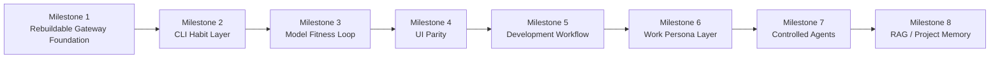
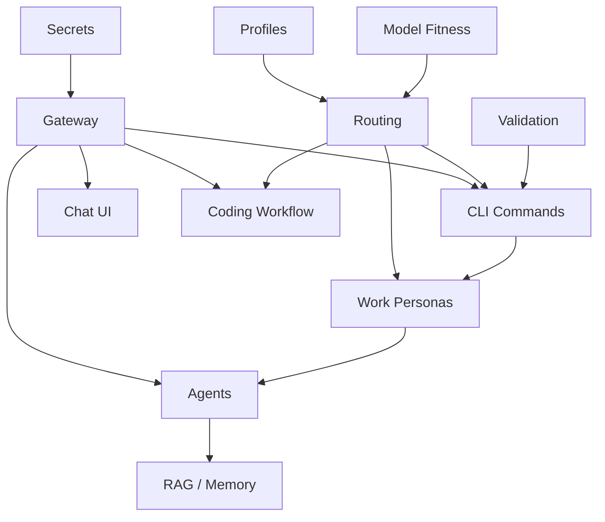

# Milestones

## 1. Purpose

This document defines the delivery milestones for **AI Dev Workstation as Code**.

I want to build the workstation in usable stages, not as one large platform build. Each milestone should add durable capability that supports the overall architecture and moves the project closer to daily use.

The delivery approach is:

```text
Build the foundation first.
Create useful CLI habits.
Add model fitness.
Add UI and coding workflows.
Then introduce agents and memory carefully.
```

The milestones are deliberately sequenced so that each later capability builds on the gateway, profile, routing, secrets and validation foundations.

---

## 2. Milestone principles

| Principle | Meaning |
|---|---|
| Foundation before features | Build the control plane before adding lots of tools. |
| Usable increments | Each milestone should create something I can actually use. |
| Profile-aware from the start | Work and personal behaviour should not be bolted on later. |
| Rebuildable by default | Every milestone should improve or preserve rebuildability. |
| Secure by default | Secrets and provider access must be handled safely from the beginning. |
| CLI-first delivery | The CLI should become useful before the UI becomes central. |
| Model choices informed by fit | Use llmfit or equivalent before locking in model aliases. |
| Agents later | Agents should wait until routing, validation and boundaries are trusted. |
| Avoid novelty traps | Do not add tools just because they are interesting. |

---

## 3. Milestone roadmap



The order can change if reality demands it, but this is the preferred delivery path.

---

## 4. Milestone summary

| Milestone | Name | Outcome |
|---:|---|---|
| 1 | Rebuildable Gateway Foundation | A profile-aware gateway foundation that can be rebuilt and validated. |
| 2 | CLI Habit Layer | Daily-use CLI commands become useful and consistent. |
| 3 | Model Fitness Loop | Model choices are informed by actual device and task fit. |
| 4 | UI Parity | Open WebUI or equivalent uses the same gateway and routing model. |
| 5 | Development Workflow | Coding tools integrate with the workstation model. |
| 6 | Work Persona Layer | Architecture, writing and work-safe workflows become more useful. |
| 7 | Controlled Agents | Agents are introduced with boundaries and profile-aware controls. |
| 8 | RAG / Project Memory | Local project/document memory is added carefully. |

---

# 5. Milestone 1 — Rebuildable Gateway Foundation

## Intent

Establish the minimum foundation for the workstation.

This milestone should prove that the project can define profiles, configure providers, start or reach a gateway, handle secrets safely, route to at least one local model path, and validate the environment.

The goal is not to build every future workflow. The goal is to build the spine.

## Target capabilities

| Capability | Expected state |
|---|---|
| Profiles | Initial `macos-work` and `windows-personal` profiles defined. |
| Secrets | Bitwarden preferred; `.env.local` fallback documented. |
| Gateway | LiteLLM or equivalent trialled as model gateway. |
| Providers | Local and frontier provider placeholders defined. |
| Routing | Basic config-led routing structure created. |
| CLI | Basic `ask-ai`, `ai-route` and `ai-status` started. |
| Validation | Basic `ai-bootstrap-check` created. |
| Rebuildability | Bootstrap approach exists, even if not fully automated. |

## Expected deliverables

- repo structure aligned to target architecture
- `profiles/macos-work/profile.yaml`
- `profiles/windows-personal/profile.yaml`
- `.env.example`
- Bitwarden-oriented secrets notes
- `config/providers.yaml`
- `config/models.yaml`
- `config/routes.yaml`
- `config/policies.yaml`
- basic gateway configuration
- basic service/container definition for gateway
- initial `ask-ai`
- initial `ai-route`
- initial `ai-status`
- initial `ai-bootstrap-check`
- documented manual steps

## Example target flow

```bash
git clone https://github.com/Deim0s13/ai-lab.git
cd ai-lab
./bootstrap/bootstrap.sh --profile macos-work
ai-bootstrap-check
ask-ai --local "Explain what this workstation does"
```

## Success criteria

This milestone is successful when:

- I can select a profile.
- The repo has a clear rebuild structure.
- Secrets are not committed.
- The gateway can be started or reached.
- At least one local route can be tested.
- Provider placeholders are configured without exposing secrets.
- `ai-status` can report useful health information.
- `ai-route` can explain a basic routing decision.
- The setup is documented well enough to repeat.

## Not included

- full semantic routing
- full coding assistant integration
- Open WebUI parity
- agents
- RAG/project memory
- advanced observability
- complete model installation automation

---

# 6. Milestone 2 — CLI Habit Layer

## Intent

Turn the foundation into something I start using regularly from the terminal.

This milestone is about making the CLI useful, simple and habit-forming.

## Target capabilities

| Capability | Expected state |
|---|---|
| `ask-ai` | Useful for everyday local and routed prompts. |
| `ai-route` | Explains routing decisions clearly. |
| `ai-status` | Shows profile, gateway, runtime and provider health. |
| Profiles | Active profile selection is visible. |
| Routing | Basic route flags work. |
| Output handling | Optional save/copy patterns explored. |

## Expected deliverables

- improved `ask-ai`
- support for `--local`
- support for `--best`
- support for `--explain-route`
- active profile detection
- basic output save option
- clearer route explanation
- simple help text
- CLI usage examples in docs
- profile-aware status output

## Example target flow

```bash
ask-ai --local "Summarise this note"
ask-ai --best --explain-route "Review this architecture option"
ai-route --profile macos-work --sensitivity internal "Summarise work notes"
ai-status
```

## Success criteria

This milestone is successful when:

- I naturally start using `ask-ai` instead of opening a separate tool for simple tasks.
- I can see which profile is active.
- I can force local-only behaviour.
- I can request best-available behaviour.
- I can understand why a route was selected.
- The CLI feels like the front door to the workstation.

## Not included

- advanced agent workflows
- repo-aware coding
- RAG
- complex routing automation
- usage analytics

---

# 7. Milestone 3 — Model Fitness Loop

## Intent

Ground local model choices in actual device and task fit.

I do not want routing aliases to be based on hype or random model choices. I want to understand what runs well on each device and what each model is useful for.

## Target capabilities

| Capability | Expected state |
|---|---|
| Model fitness | llmfit or equivalent process trialled. |
| Device results | Results captured for macOS and Windows profiles. |
| Model aliases | Initial aliases informed by actual results. |
| Model review | Repeatable process defined. |
| Routing | Routes updated based on model fit. |

## Expected deliverables

- llmfit trial
- result capture location
- model review notes per profile
- initial local model shortlist for `macos-work`
- initial local model shortlist for `windows-personal`
- initial mapping for `local_fast`
- initial mapping for `local_capable`
- initial mapping for `local_code`
- `ai-model-review` placeholder or initial helper
- docs updated with model selection outcomes

## Example target flow

```bash
ai-model-review --profile macos-work
ai-model-review --profile windows-personal
ai-route --task summarise --profile macos-work
```

## Success criteria

This milestone is successful when:

- I know which models are worth keeping on each device.
- I know which models are too slow or not useful.
- Routing aliases are mapped to real model choices.
- `ai-status` can show unresolved or missing model aliases.
- Model review becomes a repeatable maintenance activity.

## Not included

- exhaustive benchmarking
- public benchmark comparisons
- automated model downloading for every alias
- advanced model scoring

---

# 8. Milestone 4 — UI Parity

## Intent

Add a browser-based UI without creating a separate AI environment.

Open WebUI or an equivalent tool should use the same gateway, provider posture and routing model where practical.

## Target capabilities

| Capability | Expected state |
|---|---|
| Chat UI | Open WebUI or equivalent trialled. |
| Gateway integration | UI connects to gateway where practical. |
| Profiles | UI behaviour aligns to active profile or documented config. |
| Rebuildability | UI service is containerised or repeatably configured. |
| Data handling | Persistence and storage behaviour understood. |

## Expected deliverables

- Open WebUI container/service definition
- gateway connection from UI
- documented UI setup
- validation check for UI service
- notes on persistence and storage
- profile-aware usage guidance
- decision on whether Open WebUI becomes adopted

## Example target flow

```bash
ai-status
podman compose up -d open-webui
```

Then use the UI against the same model layer as the CLI.

## Success criteria

This milestone is successful when:

- I can use a browser UI against the workstation model layer.
- The UI does not bypass the gateway unnecessarily.
- The UI does not create confusing separate provider configuration.
- I understand where UI data is stored.
- The UI can be rebuilt or restarted consistently.

## Not included

- RAG
- multi-user production setup
- enterprise chat platform patterns
- complex auth or identity integration

---

# 9. Milestone 5 — Development Workflow

## Intent

Add practical coding workflows to the workstation.

This milestone should explore CLI coding tools such as Aider or OpenCode and decide how they fit alongside existing tools such as Claude Code, Codex and Cursor.

The goal is not to replace everything. The goal is to create a useful local-first and routed coding workflow inside this workstation.

## Target capabilities

| Capability | Expected state |
|---|---|
| CLI coding assistant | Aider, OpenCode or equivalent trialled. |
| Local coding route | Local coding model tested. |
| Frontier coding route | OpenAI/Anthropic/Cursor/Gemini posture tested by profile. |
| File safety | Editing behaviour understood. |
| Rebuildability | Tool install and config documented. |

## Expected deliverables

- trial record for Aider and/or OpenCode
- coding assistant install steps
- gateway compatibility assessment
- local coding model test
- frontier coding route test
- file modification safety notes
- recommendation on adopted/preferred coding workflow
- profile-specific coding guidance

## Example target flow

```bash
dev-ai explain ./scripts/bootstrap.sh
dev-ai fix failing-test
dev-ai --local explain this error
```

Exact commands may change depending on selected tool.

## Success criteria

This milestone is successful when:

- I know which CLI coding assistant fits the workstation.
- I understand whether local models are good enough for useful coding tasks.
- I know when to escalate to frontier coding models.
- File modification behaviour feels safe and transparent.
- The coding workflow complements rather than duplicates existing tools.

## Not included

- fully autonomous coding agents
- large-scale repo automation
- replacing Claude Code, Codex or Cursor
- work-profile agentic coding without safeguards

---

# 10. Milestone 6 — Work Persona Layer

## Intent

Create higher-value workflows for architecture, writing, research and work-safe thinking.

This milestone is especially important for the `macos-work` profile.

I want the workstation to support how I actually work: architecture decisions, customer preparation, structured writing, option analysis and technical framing.

## Target capabilities

| Capability | Expected state |
|---|---|
| Architecture assistant | `architect-ai` created or prototyped. |
| Writing assistant | `write-ai` created or prototyped. |
| Research assistant | `research-ai` created or prototyped. |
| Context loading | Safe, profile-aware context patterns explored. |
| Work profile posture | Approved-tool-first behaviour reinforced. |

## Expected deliverables

- architecture persona/context file
- writing style/context file
- research workflow notes
- `architect-ai` prototype
- `write-ai` prototype
- `research-ai` prototype
- profile-aware context loading
- examples for work-safe routing
- guidance for when frontier escalation is appropriate

## Example target flow

```bash
architect-ai --profile macos-work review docs/adr/0001-gateway-first.md
write-ai --profile macos-work polish notes.md
research-ai --profile macos-work compare "LiteLLM vs alternative gateways"
```

## Success criteria

This milestone is successful when:

- The workstation helps me produce better architecture and writing outputs.
- Work profile routing remains conservative and approved-tool aware.
- Context loading is useful but not unsafe.
- I can use stable commands for architecture and writing workflows.
- These workflows feel more useful than generic prompting.

## Not included

- large RAG implementation
- autonomous research agents
- uncontrolled work context indexing
- broad memory system

---

# 11. Milestone 7 — Controlled Agents

## Intent

Introduce agents carefully, after the foundation is trusted.

Agents should support constrained workflows with explicit permissions, observable execution and profile-aware boundaries.

This milestone should start in the personal profile before work-profile use is considered.

## Target capabilities

| Capability | Expected state |
|---|---|
| Agent runner | Goose or equivalent trialled. |
| Permissions | File and tool access understood. |
| Routing | Agents use gateway where practical. |
| Profiles | Personal profile enabled first; work profile restricted. |
| Observability | Agent actions are visible enough to trust. |

## Expected deliverables

- agent runner trial record
- install and config steps
- permission model notes
- simple constrained workflow
- profile policy for agents
- safety guidance
- decision on whether to adopt agent runner

## Example target flow

```bash
agent-ai --profile windows-personal run "summarise this repo and suggest next docs"
```

The exact command may change. The important point is that agent use should be deliberate and constrained.

## Success criteria

This milestone is successful when:

- I can run a constrained agent workflow safely.
- I understand what files and tools the agent can access.
- I can see which model route the agent uses.
- Personal profile agent use is useful.
- Work profile agent use remains disabled or tightly restricted.

## Not included

- unrestricted autonomous agents
- work-profile agents with broad file access
- production automation
- unattended background execution
- complex multi-agent systems

---

# 12. Milestone 8 — RAG / Project Memory

## Intent

Add project and document memory only after the workstation has stable routing, profile boundaries and useful workflows.

RAG and memory can be powerful, but they can also introduce complexity, privacy risk and stale context. This milestone should be deliberate.

## Target capabilities

| Capability | Expected state |
|---|---|
| Document indexing | Local indexing approach selected. |
| Retrieval | Basic retrieval works against selected context. |
| Embeddings | Embedding model/provider selected. |
| Profile boundaries | Work and personal indexes stay separate. |
| CLI integration | Retrieval supports CLI workflows. |
| Agent integration | Future agent use considered. |

## Expected deliverables

- RAG tool selection notes
- storage/indexing design
- embedding model choice
- context boundary rules
- profile-specific indexes
- CLI retrieval prototype
- validation checks for indexes
- decision on adoption

## Example target flow

```bash
research-ai --profile windows-personal --project ai-lab "What did I decide about routing?"
architect-ai --profile macos-work --context docs "Summarise the architecture decisions"
```

## Success criteria

This milestone is successful when:

- I can query selected local project context.
- Work and personal indexes remain separated.
- Retrieval improves outputs without adding too much friction.
- The storage/index model is understandable and rebuildable.
- RAG supports real workflows rather than becoming infrastructure for its own sake.

## Not included

- broad indexing of all personal or work files
- uncontrolled memory
- enterprise knowledge platform patterns
- complex vector infrastructure unless needed

---

## 13. Cross-milestone dependencies



The most important dependencies are:

- profiles before serious routing
- secrets before frontier providers
- gateway before UI/coding/agents
- validation before rebuild confidence
- model fitness before stable model aliases
- profile boundaries before RAG or agents

---

## 14. Definition of done by milestone

Each milestone should be considered done only when it has:

| Requirement | Meaning |
|---|---|
| Working capability | Something usable exists. |
| Profile awareness | Behaviour is clear for relevant profiles. |
| Rebuild path | Install/config steps are documented or automated. |
| Validation | Health or status can be checked. |
| Documentation | Relevant docs are updated. |
| Lifecycle status | Components have status updated. |
| ADRs | Architecture-significant decisions are recorded. |
| Manual steps | Known manual steps are documented. |

A milestone is not done just because a tool was installed.

---

## 15. Backlog parking lot

Potential future work that should not distract from the current milestones:

- cost-aware routing
- route logging and analytics
- semantic routing
- automatic sensitivity detection
- richer model evaluation
- automatic model download and pruning
- advanced Open WebUI configuration
- local observability stack
- voice input/output
- mobile access
- scheduled model review
- project-specific coding agents
- advanced RAG pipelines
- multi-agent workflows
- remote GPU host
- shared team version of the workstation

These may be useful later, but they should not be allowed to derail the foundation.

---

## 16. Immediate next step

The immediate next step is Milestone 1.

Milestone 1 should create the smallest useful gateway foundation:

```text
profiles
secrets
gateway
routing config
basic CLI
validation
documentation
```

Once that spine exists, the workstation can grow without becoming a pile of disconnected experiments.

---

## 17. Summary

The delivery strategy is:

```text
Foundation first.
CLI habits second.
Model fitness before model confidence.
UI and coding after the gateway.
Work personas after routing.
Agents after guardrails.
Memory after boundaries.
```

Each milestone should make the workstation more useful, more rebuildable and more likely to become part of my normal workflow.
